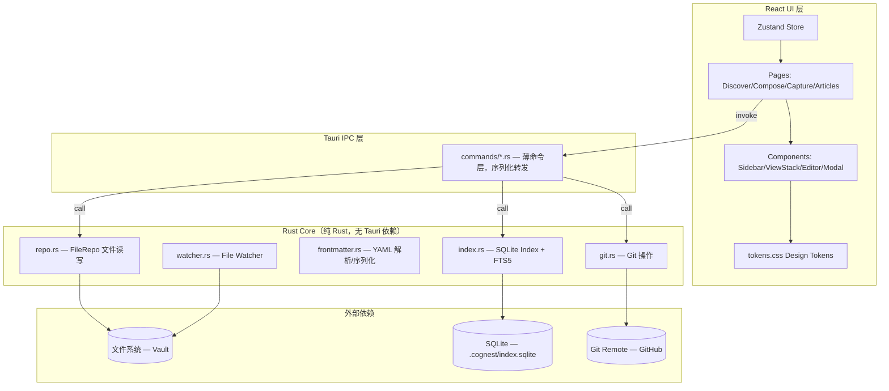
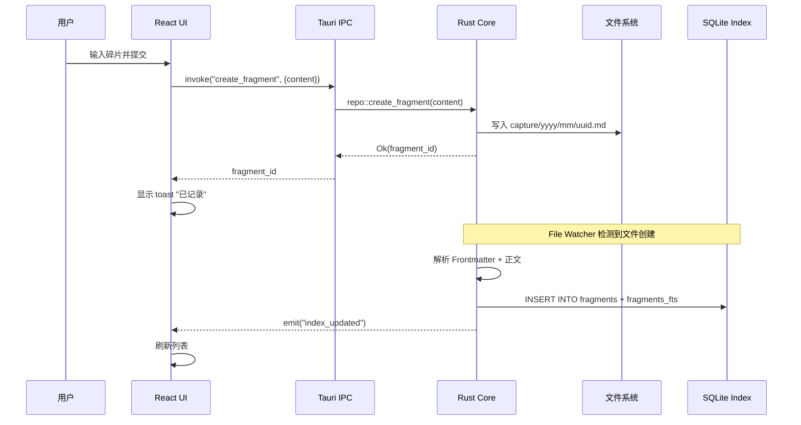
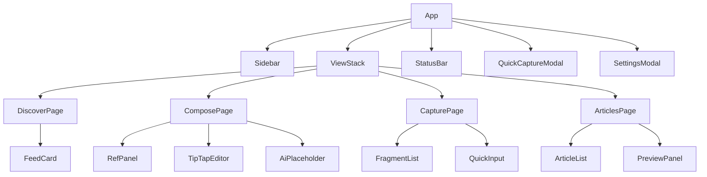

# 技术设计文档 — Cognest MVP

## Overview

本文档描述 Cognest MVP（Phase 0 + Phase 1 合并范围）的技术设计方案。目标是实现一个**无 AI/LLM 依赖**的本地优先桌面应用，验证核心信息架构和用户体验。

核心技术决策：
- **Tauri v2** 作为桌面框架，React + TypeScript + Vite 渲染前端
- **Rust Core** 为纯 Rust crate（不依赖 Tauri 类型），负责数据层、文件操作、Git 操作
- **文件系统为唯一事实来源**，SQLite 为可丢弃派生索引
- **渐进式启动**：先渲染壳，后台异步加载数据

### ⚠️ 重要实现约束（AI 必读）

1. **Tauri v2 无 tokio runtime**：`setup()` 和 IPC 命令层运行在主线程，严禁 `tokio::spawn`。后台任务用 `std::thread::spawn`。

2. **IPC 数据契约 — 列表 vs 详情**：
   - `list_articles` → `Vec<ArticleRecord>`（索引记录，**无 content/word_count 字段**）
   - `get_article` → `ArticleResponse`（完整记录，含正文）
   - 前端 store 接收 `ArticleRecord` 后必须规范化（补默认值、status 映射 `completed`→`done`）

3. **写文件后立即同步索引**：`create_article`/`save_article` 写完 `.md` 文件后立即 `INSERT OR REPLACE` 到 IndexDb，不等 File Watcher 异步检测。

4. **碎片可编辑**（Phase 1.5 变更）：碎片正文不再 immutable，通过 `update_fragment` IPC 允许编辑。

## Architecture

### 系统分层架构



### 数据流



## Components and Interfaces

### Rust Core 模块接口

#### repo.rs — 文件仓库操作

```rust
use std::path::PathBuf;
use chrono::{DateTime, Utc};

/// 碎片元数据结构
#[derive(Debug, Clone, serde::Serialize, serde::Deserialize)]
pub struct FragmentMeta {
    pub id: String,           // 8位十六进制
    pub created: DateTime<Utc>,
    pub source: String,       // "manual"
    pub tags: Vec<String>,
    pub topics: Vec<String>,
}

/// 文章元数据结构
#[derive(Debug, Clone, serde::Serialize, serde::Deserialize)]
pub struct ArticleMeta {
    pub id: String,           // 8位十六进制
    pub title: String,
    pub status: ArticleStatus,
    pub created: DateTime<Utc>,
    pub updated: DateTime<Utc>,
    pub tags: Vec<String>,
}

#[derive(Debug, Clone, serde::Serialize, serde::Deserialize)]
pub enum ArticleStatus {
    Draft,
    Editing,
    Completed,
}

/// 文件仓库核心接口
pub struct FileRepo {
    vault_path: PathBuf,
}

impl FileRepo {
    pub fn new(vault_path: PathBuf) -> Self;
    
    /// 创建新碎片文件，返回碎片 ID
    pub fn create_fragment(&self, content: &str) -> Result<String, RepoError>;
    
    /// 读取碎片：解析 frontmatter + 正文
    pub fn read_fragment(&self, id: &str) -> Result<(FragmentMeta, String), RepoError>;
    
    /// 列出所有碎片文件路径
    pub fn list_fragment_paths(&self) -> Result<Vec<PathBuf>, RepoError>;
    
    /// 创建新文章文件，返回文章 ID
    pub fn create_article(&self, title: &str) -> Result<String, RepoError>;
    
    /// 读取文章
    pub fn read_article(&self, id: &str) -> Result<(ArticleMeta, String), RepoError>;
    
    /// 保存文章内容（更新 frontmatter updated 字段）
    pub fn save_article(&self, id: &str, meta: &ArticleMeta, content: &str) -> Result<(), RepoError>;
    
    /// 删除文章文件
    pub fn delete_article(&self, id: &str) -> Result<(), RepoError>;
    
    /// 导出文章到指定路径
    pub fn export_article(&self, id: &str, dest: &PathBuf) -> Result<(), RepoError>;
    
    /// 计算文件内容哈希 (sha256)
    pub fn content_hash(content: &[u8]) -> String;
}
```

#### frontmatter.rs — YAML Frontmatter 解析器

```rust
use serde::{Serialize, de::DeserializeOwned};

/// 解析结果：frontmatter 结构体 + 正文
pub struct ParsedDocument<T> {
    pub meta: T,
    pub body: String,
}

/// 解析 Markdown 文件的 YAML Frontmatter
/// 
/// 规则：
/// - 首行必须是 `---`
/// - 找到下一个仅含 `---` 的行作为结束标记
/// - 中间内容用 serde_yaml 解析为 T
/// - 结束标记之后的内容作为正文返回
pub fn parse<T: DeserializeOwned>(input: &str) -> Result<ParsedDocument<T>, FrontmatterError>;

/// 序列化 frontmatter 并与正文拼接
///
/// 输出格式：
/// ---
/// {yaml fields}
/// ---
///
/// {body}
pub fn serialize<T: Serialize>(meta: &T, body: &str) -> Result<String, FrontmatterError>;

#[derive(Debug, thiserror::Error)]
pub enum FrontmatterError {
    #[error("文件不包含合法的 Frontmatter 分隔符: {path} 第 {line} 行")]
    MissingDelimiter { path: String, line: usize },
    
    #[error("YAML 解析失败: {path} 第 {line} 行 - {reason}")]
    YamlParseError { path: String, line: usize, reason: String },
    
    #[error("序列化失败: {0}")]
    SerializeError(String),
}
```

#### index.rs — SQLite 索引

```rust
use rusqlite::Connection;

pub struct IndexDb {
    conn: Connection,
}

/// 碎片索引记录
#[derive(Debug, Clone, serde::Serialize, serde::Deserialize)]
pub struct FragmentRecord {
    pub id: String,
    pub content: String,
    pub created_at: String,
    pub source: String,
    pub tags: Vec<String>,
    pub topics: Vec<String>,
    pub content_hash: String,
}

/// 文章索引记录
#[derive(Debug, Clone, serde::Serialize, serde::Deserialize)]
pub struct ArticleRecord {
    pub id: String,
    pub title: String,
    pub status: String,
    pub created_at: String,
    pub updated_at: String,
    pub tags: Vec<String>,
    pub content_hash: String,
}

/// 搜索结果
#[derive(Debug, Clone, serde::Serialize, serde::Deserialize)]
pub struct SearchResult {
    pub id: String,
    pub snippet: String,       // 最多150字符，标记匹配位置
    pub match_start: usize,
    pub match_end: usize,
    pub rank: f64,
}

impl IndexDb {
    /// 打开或创建索引数据库
    pub fn open(db_path: &Path) -> Result<Self, IndexError>;
    
    /// 初始化表结构（fragments, fragments_fts, articles）
    pub fn init_schema(&self) -> Result<(), IndexError>;
    
    /// 验证数据库完整性
    pub fn check_integrity(&self) -> Result<bool, IndexError>;
    
    /// 插入碎片索引
    pub fn insert_fragment(&self, record: &FragmentRecord) -> Result<(), IndexError>;
    
    /// 更新碎片索引（hash 变化时）
    pub fn update_fragment(&self, record: &FragmentRecord) -> Result<(), IndexError>;
    
    /// 删除碎片索引
    pub fn delete_fragment(&self, id: &str) -> Result<(), IndexError>;
    
    /// 插入文章索引
    pub fn insert_article(&self, record: &ArticleRecord) -> Result<(), IndexError>;
    
    /// 更新文章索引
    pub fn update_article(&self, record: &ArticleRecord) -> Result<(), IndexError>;
    
    /// 删除文章索引
    pub fn delete_article(&self, id: &str) -> Result<(), IndexError>;
    
    /// FTS5 全文搜索碎片（返回最多 50 条）
    pub fn search_fragments(&self, query: &str, limit: usize) -> Result<Vec<SearchResult>, IndexError>;
    
    /// FTS5 全文搜索文章
    pub fn search_articles(&self, query: &str, limit: usize) -> Result<Vec<SearchResult>, IndexError>;
    
    /// 获取碎片总数
    pub fn fragment_count(&self) -> Result<u64, IndexError>;
    
    /// 获取文章总数
    pub fn article_count(&self) -> Result<u64, IndexError>;
    
    /// 按条件查询碎片列表
    pub fn list_fragments(&self, filter: FragmentFilter, offset: u64, limit: u64) -> Result<Vec<FragmentRecord>, IndexError>;
    
    /// 按条件查询文章列表
    pub fn list_articles(&self, filter: ArticleFilter) -> Result<Vec<ArticleRecord>, IndexError>;
    
    /// 获取过去 N 天的统计数据（发现页用）
    pub fn stats_last_days(&self, days: u32) -> Result<StatsResult, IndexError>;
    
    /// 获取高频标签 TOP N
    pub fn top_tags(&self, days: u32, limit: usize) -> Result<Vec<(String, u32)>, IndexError>;
    
    /// 全量重建索引
    pub fn rebuild_from_vault(&self, repo: &FileRepo) -> Result<RebuildReport, IndexError>;
}

#[derive(Debug, Clone)]
pub enum FragmentFilter {
    All,
    Uncategorized,  // topics 为空
    Categorized,    // topics 非空
}
```

#### watcher.rs — 文件监听

> **⚠️ 实现约束：** Tauri v2 的 `setup()` 不在 tokio runtime 内。
> File Watcher 后台任务必须用 `std::thread::spawn` + `std::sync::mpsc::Receiver::recv_timeout`，
> **严禁使用 `tokio::spawn`、`tokio::sync::mpsc`、`tokio::time::sleep`**，否则会 panic。

```rust
use notify::{Watcher, RecursiveMode};
use std::sync::{mpsc, Arc, Mutex};   // std channel
use std::time::{Duration, Instant};

/// 文件变更事件
#[derive(Debug, Clone)]
pub enum FileEvent {
    Created(PathBuf),
    Modified(PathBuf),
    Deleted(PathBuf),
}

/// 启动文件监听器（在 std thread 中运行 debounce loop）
pub fn start_watcher(
    vault_path: PathBuf,
    index: Arc<Mutex<IndexDb>>,
    app_handle: tauri::AppHandle,
) -> Result<WatcherHandle, WatcherError>;

/// 持有此 handle 保持监听器运行，drop 则停止
pub struct WatcherHandle {
    _watcher: notify::RecommendedWatcher,
    _thread_handle: std::thread::JoinHandle<()>,  // NOT tokio task
}

// 内部 debounce 实现：rx.recv_timeout(500ms) 轮询，无需 tokio runtime
```

#### git.rs — Git 操作

```rust
use git2::Repository;

pub struct GitModule {
    repo: Repository,
}

/// Git 同步状态
#[derive(Debug, Clone, serde::Serialize, serde::Deserialize)]
pub enum SyncStatus {
    Synced,
    Unsynced { file_count: usize },
    NoRemote,
}

impl GitModule {
    /// 打开已有仓库
    pub fn open(vault_path: &Path) -> Result<Self, GitError>;
    
    /// 获取当前同步状态
    pub fn sync_status(&self) -> Result<SyncStatus, GitError>;
    
    /// 执行 add + commit + push
    /// 提交信息格式："sync: N files changed · YYYY-MM-DD HH:mm"
    /// push 超时 30 秒
    pub fn sync(&self) -> Result<SyncResult, GitError>;
    
    /// 确保 .gitignore 包含必要排除项
    pub fn ensure_gitignore(&self) -> Result<(), GitError>;
}

#[derive(Debug)]
pub struct SyncResult {
    pub files_changed: usize,
    pub commit_sha: String,
}
```

### Tauri IPC 命令层

```rust
// src-tauri/src/commands/mod.rs
// 每个命令是 Tauri #[command] 宏标注的函数
// 只做参数反序列化 → 调用 Core → 结果序列化返回

#[tauri::command]
async fn create_fragment(content: String, state: State<'_, AppState>) -> Result<String, String>;

#[tauri::command]
async fn list_fragments(filter: String, offset: u64, limit: u64, state: State<'_, AppState>) -> Result<Vec<FragmentRecord>, String>;

#[tauri::command]
async fn search_fragments(query: String, state: State<'_, AppState>) -> Result<Vec<SearchResult>, String>;

#[tauri::command]
async fn create_article(title: String, state: State<'_, AppState>) -> Result<String, String>;

#[tauri::command]
async fn get_article(id: String, state: State<'_, AppState>) -> Result<ArticleWithContent, String>;

#[tauri::command]
async fn save_article(id: String, title: String, status: String, content: String, state: State<'_, AppState>) -> Result<(), String>;

#[tauri::command]
async fn delete_article(id: String, state: State<'_, AppState>) -> Result<(), String>;

#[tauri::command]
async fn export_article(id: String, dest: String, state: State<'_, AppState>) -> Result<(), String>;

#[tauri::command]
async fn search_articles(query: String, state: State<'_, AppState>) -> Result<Vec<SearchResult>, String>;

#[tauri::command]
async fn list_articles(filter: String, tags: Vec<String>, state: State<'_, AppState>) -> Result<Vec<ArticleRecord>, String>;

// ⚠️ 重要：list_articles 返回 ArticleRecord（索引记录），不含正文(content)和字数(word_count)
// get_article 返回 ArticleResponse，含完整正文和元数据
// 前端 store 的 loadArticles() 必须在接收 ArticleRecord 后做规范化映射：
//   - content: r.content ?? ''
//   - word_count: r.word_count ?? 0
//   - status: "completed" → "done"（后端与前端枚举值不同）
// 参见 src/stores/articlesStore.ts 的 RawArticleRecord + normalizeStatus()

#[tauri::command]
async fn git_sync(state: State<'_, AppState>) -> Result<SyncResult, String>;

#[tauri::command]
async fn git_status(state: State<'_, AppState>) -> Result<SyncStatus, String>;

#[tauri::command]
async fn get_stats(days: u32, state: State<'_, AppState>) -> Result<StatsResult, String>;

#[tauri::command]
async fn get_top_tags(days: u32, limit: usize, state: State<'_, AppState>) -> Result<Vec<TagCount>, String>;

#[tauri::command]
async fn get_counts(state: State<'_, AppState>) -> Result<Counts, String>;

#[tauri::command]
async fn get_vault_path(state: State<'_, AppState>) -> Result<String, String>;
```

### 前端组件架构



### Zustand Store 设计

```typescript
// stores/appStore.ts — 全局应用状态
interface AppState {
  currentPage: 'discover' | 'compose' | 'capture' | 'articles';
  sidebarExpanded: boolean;
  counts: { fragments: number; articles: number };
  setSidebarExpanded: (expanded: boolean) => void;
  setCurrentPage: (page: AppState['currentPage']) => void;
  refreshCounts: () => Promise<void>;
}

// stores/viewStackStore.ts — 视图栈状态
interface ViewStackState {
  stacks: Record<string, ViewEntry[]>;  // 每个功能页独立栈，最大深度10
  push: (page: string, view: ViewEntry) => void;
  pop: (page: string) => void;
  current: (page: string) => ViewEntry | null;
}

interface ViewEntry {
  id: string;
  component: string;
  props: Record<string, unknown>;
}

// stores/captureStore.ts — 碎片页状态
interface CaptureState {
  fragments: Fragment[];
  filter: 'all' | 'uncategorized' | 'categorized';
  totalCount: number;
  loading: boolean;
  searchQuery: string;
  loadFragments: () => Promise<void>;
  setFilter: (filter: CaptureState['filter']) => void;
  search: (query: string) => Promise<void>;
}

// stores/articlesStore.ts — 文章页状态
interface ArticlesState {
  articles: Article[];
  selectedId: string | null;
  statusFilter: 'all' | 'draft' | 'editing' | 'completed';
  tagFilter: string[];
  searchQuery: string;
  loadArticles: () => Promise<void>;
  setStatusFilter: (filter: ArticlesState['statusFilter']) => void;
  toggleTag: (tag: string) => void;
  selectArticle: (id: string) => void;
}

// stores/composeStore.ts — 创作页状态
interface ComposeState {
  currentArticleId: string | null;
  immersiveMode: boolean;
  relatedFragments: Fragment[];
  toggleImmersive: () => void;
  loadRelated: (articleId: string) => Promise<void>;
}

// stores/discoverStore.ts — 发现页状态
interface DiscoverState {
  cards: FeedCard[];
  dismissedCards: Set<string>;  // 当前会话内已关闭的卡片
  loadCards: () => Promise<void>;
  dismissCard: (cardId: string) => void;
}
```

### ViewStack 导航模型

```typescript
// components/ViewStack.tsx
// 核心实现：每个功能页独立维护视图栈，最大深度 10

interface ViewStackProps {
  pageId: string;
  rootComponent: React.ComponentType;
}

// 导航动画：
// - 前进（push）: 新视图从右侧滑入，duration: var(--motion-base) 220ms
// - 后退（pop）: 当前视图向右滑出，duration: var(--motion-base) 220ms
// - 曲线: var(--ease-standard) cubic-bezier(0.28, 0, 0.22, 1)

// 行为规则：
// - 侧边栏切换功能页时保留原页面栈状态
// - 栈深度 > 0 时显示 "← 返回" 按钮
// - 栈深度 = 0 时 Esc 和返回按钮无效果
// - 每个功能页最大栈深度 10
```

### TipTap 编辑器扩展

```typescript
// components/Editor.tsx — TipTap 编辑器配置

// 支持的格式：
// - 标题: H1, H2, H3
// - 内联: 加粗, 斜体, 行内代码
// - 块级: 代码块, 引用块, 有序列表, 无序列表

// 自定义扩展：
// 1. ReferenceChip Node — @[fragment-id] 引用芯片
//    - 不可编辑的内联节点
//    - 显示为 accent 色背景标签，内容为 8 位短 ID
//    - 序列化时输出 @[fragment-id]
//    - 反序列化时解析 @[fragment-id] 语法
//    - 引用不存在的碎片时显示失效状态

// 2. AutoSave — 停止输入 1 秒后自动保存
//    - 使用 debounce 监听 editor.on('update')
//    - 序列化为 Markdown 格式
//    - 调用 IPC save_article 命令
```

## Data Models

### 碎片文件格式

```yaml
---
id: a1b2c3d4                          # 8位十六进制 UUID 短前缀
created: 2026-06-25T10:30:00+08:00    # ISO 8601 含时区
source: manual                         # 固定值
tags: []                               # AI 后续填充
topics: []                             # AI 后续填充
---

用户输入的碎片正文内容
```

文件路径: `capture/yyyy/mm/<id>.md`

### 文章文件格式

```yaml
---
id: x9y8z7w6                          # 8位十六进制 UUID 短前缀
title: 文章标题
status: draft                          # draft | editing | completed
created: 2026-06-25T14:00:00+08:00
updated: 2026-06-25T16:00:00+08:00
tags: [tag1, tag2]
---

# 文章标题

正文内容... @[a1b2c3d4] 引用碎片
```

文件路径: `articles/<id>.md`

### SQLite Schema

```sql
-- 碎片索引表
CREATE TABLE fragments (
    id TEXT PRIMARY KEY,
    content TEXT NOT NULL,
    created_at TEXT NOT NULL,
    source TEXT NOT NULL,
    tags TEXT NOT NULL DEFAULT '[]',       -- JSON array
    topics TEXT NOT NULL DEFAULT '[]',     -- JSON array
    content_hash TEXT NOT NULL             -- sha256 hex
);

-- FTS5 全文检索虚拟表
CREATE VIRTUAL TABLE fragments_fts USING fts5(
    content, tags,
    tokenize='trigram'
);

-- 文章索引表
CREATE TABLE articles (
    id TEXT PRIMARY KEY,
    title TEXT NOT NULL,
    status TEXT NOT NULL,
    created_at TEXT NOT NULL,
    updated_at TEXT NOT NULL,
    tags TEXT NOT NULL DEFAULT '[]',       -- JSON array
    content_hash TEXT NOT NULL             -- sha256 hex
);

-- FTS5 文章全文检索
CREATE VIRTUAL TABLE articles_fts USING fts5(
    title, content,
    tokenize='trigram'
);
```

### 前端数据类型

```typescript
interface Fragment {
  id: string;
  content: string;
  createdAt: string;       // ISO 8601
  source: string;
  tags: string[];
  topics: string[];
}

interface Article {
  id: string;
  title: string;
  status: 'draft' | 'editing' | 'completed';
  createdAt: string;
  updatedAt: string;
  tags: string[];
  wordCount: number;
}

interface FeedCard {
  id: string;
  type: 'weekly-stats' | 'top-tags' | 'activity';
  title: string;
  data: Record<string, unknown>;
  priority: number;        // 排序权重
}

interface SearchResult {
  id: string;
  snippet: string;
  matchStart: number;
  matchEnd: number;
  rank: number;
}

interface SyncStatus {
  status: 'synced' | 'unsynced' | 'no-remote';
  fileCount?: number;
}
```


## Correctness Properties

*属性（Property）是指在系统所有合法执行路径中都应成立的特征或行为——本质上是对系统应该做什么的形式化陈述。属性是人类可读规格说明与机器可验证正确性保证之间的桥梁。*

### Property 1: Frontmatter 序列化/解析 Round-Trip

*For any* 合法的 FragmentMeta 或 ArticleMeta 结构体，执行 `serialize(meta, body)` 后再执行 `parse(result)` 所得的结构体与原始结构体所有字段值逐字段相等，且正文内容完全一致。

**Validates: Requirements 4.5**

### Property 2: 碎片文件创建格式不变量

*For any* 有效的碎片正文（至少 1 个非空白字符）和创建时间戳，`create_fragment` 产出的文件应满足：路径符合 `capture/yyyy/mm/<8位hex>.md` 格式，Frontmatter 包含 id/created/source/tags/topics 五个字段且按此顺序排列，id 为 8 位十六进制，created 为 ISO 8601 含时区格式，source 值为 "manual"，tags 和 topics 为空数组。

**Validates: Requirements 3.1, 3.2**

### Property 3: 碎片正文保持不变量

> **⚠️ 实现变更（Phase 1.5）：** PRD 原设计为碎片 immutable（append-only）。
> 实际产品决策改为**允许编辑碎片正文**（用户反馈需要）。
> 前端通过 `update_fragment` IPC 命令调用 `FileRepo::update_fragment_content()` 更新正文，保留 frontmatter。
> Property 3 的不变量测试已不适用，但 round-trip 属性（Property 1, 2）仍有效。

*For any* 碎片正文内容，创建碎片文件后读取该文件，Frontmatter 结束标记 `---` 之后的正文应与原始输入完全一致（字节级相等），且经过任何后续 Frontmatter 字段更新操作后正文仍保持不变。

**Validates: Requirements 3.3, 3.7**

### Property 4: 索引计数等于有效文件计数

*For any* Vault 目录中 capture/ 和 articles/ 下的 .md 文件集合，完成索引构建（首次或重建）后，fragments 表行数应等于 capture/ 中具有合法 Frontmatter 的 .md 文件总数，articles 表行数应等于 articles/ 中具有合法 Frontmatter 的 .md 文件总数。不具有合法 Frontmatter 的文件应被跳过不计入。

**Validates: Requirements 2.5, 2.6, 2.8**

### Property 5: Content Hash 变更检测

*For any* 已索引的 .md 文件，当文件内容的 SHA-256 哈希值与 Index_DB 中存储的 content_hash 字段值相同时，不应触发索引更新；当哈希值不同时，应更新对应索引记录。即：索引更新当且仅当内容实际发生变化。

**Validates: Requirements 2.7**

### Property 6: 空白输入拒绝

*For any* 仅由空白字符（空格、制表符、换行符等）组成的字符串，碎片提交操作（包括碎片页输入框和快速记录弹窗）应拒绝该输入，不创建碎片文件，不修改任何状态。

**Validates: Requirements 5.7, 8.3**

### Property 7: 碎片日期分组与排序

*For any* 碎片集合，按日期分组后每个组的日期标签应正确反映该组碎片的创建日期，组间按日期降序排列（最近的在前），组内碎片按创建时间降序排列。

**Validates: Requirements 8.4**

### Property 8: 碎片筛选正确性

*For any* 碎片集合和筛选条件，"全部" 返回所有碎片；"未整理" 仅返回 topics 为空数组的碎片；"已归类" 仅返回 topics 非空的碎片。且返回的碎片总数应等于满足筛选条件的碎片实际数量。

**Validates: Requirements 8.6, 8.7**

### Property 9: FTS5 全文搜索正确性

*For any* 非空搜索关键词和已索引的碎片/文章数据，FTS5 搜索返回的结果应满足：结果按 FTS5 rank 值降序排列，每条结果包含不超过 150 字符的上下文片段且标记了匹配关键词的起止位置，结果总数不超过 50 条。

**Validates: Requirements 9.1, 9.3, 9.4**

### Property 10: 碎片引用 Round-Trip

*For any* 包含 `@[fragment-id]` 引用语法的 Markdown 文档，加载到 TipTap 编辑器（渲染为 Reference_Chip）再序列化回 Markdown 格式后，所有 `@[fragment-id]` 引用应被完整保留，ID 值不变。

**Validates: Requirements 11.5**

### Property 11: 文章标签筛选交集语义

*For any* 文章集合和多选标签组合，筛选结果应仅包含同时拥有所有已选标签的文章（取交集）。即：对结果中每篇文章，其 tags 字段应为所选标签集合的超集。

**Validates: Requirements 12.3**

### Property 12: 高频标签排名正确性

*For any* 过去 7 天的碎片集合，"高频标签" 卡片列出的 Top 5 标签应按出现频次严格降序排列，且每个标签的碎片计数值等于该标签在 7 天窗口内实际出现的次数。

**Validates: Requirements 13.3**

### Property 13: ViewStack 最大深度不变量

*For any* 功能页的视图历史栈和任意导航操作序列，栈深度永远不超过 10。当栈已达 10 级时，新的 push 操作应替换栈顶而非继续增长。

**Validates: Requirements 7.4**

### Property 14: 侧边栏计数显示格式

*For any* 碎片或文章的总条目数 N，侧边栏导航项旁的显示值应为：当 N ≤ 999 时显示 N 的字符串形式，当 N > 999 时显示 "999+"。

**Validates: Requirements 6.5**

### Property 15: Git 同步状态正确性

*For any* Git 仓库状态，sync_status 报告应满足：当无未推送 commit 且无未暂存变更时返回 "Synced"；当存在未暂存变更或未推送 commit 时返回 "Unsynced" 且 file_count 等于涉及的文件数量；当未配置远程仓库时返回 "NoRemote"。

**Validates: Requirements 15.5**

## Error Handling

### 错误分类与处理策略

| 错误类别 | 场景 | 处理方式 |
|---------|------|---------|
| 文件 I/O 错误 | 磁盘满/权限不足 | 向用户显示错误 toast，不修改 Index_DB |
| Frontmatter 解析失败 | 格式不合法 | 跳过该文件，记录日志（路径+行号） |
| Index_DB 损坏 | integrity_check 失败 | 删除并完整重建 |
| Index_DB 写入失败 | 锁冲突/其他 | 保留已创建文件，标记待索引 |
| Git push 失败 | 网络/认证错误 | Status_Bar 显示错误，保留本地 commit |
| Git 无远程仓库 | 未配置 remote | Status_Bar 提示需配置 |
| FTS5 搜索失败 | 查询语法错误 | 返回空结果，不崩溃 |
| File Watcher 事件丢失 | 系统限制 | 下次启动时增量校验 |

### 错误传播链路

```
Rust Core 错误
  → thiserror 定义具体错误类型
  → IPC 命令层捕获并转为 JSON 错误字符串
  → 前端 invoke 的 catch 分支处理
  → 根据错误类型显示 toast 或 Status_Bar 提示
```

### 关键错误场景处理

1. **碎片写入失败**：保持 Quick_Capture_Modal 打开，显示错误 toast，保留用户输入
2. **文章自动保存失败**：Status_Bar 显示 "保存失败"，编辑器内容不丢失，下次触发时重试
3. **首次索引构建中断**：记录 last_scan 进度，下次启动从断点续扫
4. **File Watcher 连接断开**：在 Status_Bar 显示警告，尝试重连，失败时记录日志

## Testing Strategy

### 测试框架选型

| 层面 | 框架 | 说明 |
|------|------|------|
| Rust 单元测试 | 内置 `#[cfg(test)]` + `cargo test` | Rust Core 逻辑测试 |
| Rust 属性测试 | `proptest` crate | Frontmatter round-trip、索引逻辑等 |
| 前端单元测试 | Vitest + React Testing Library | 组件行为测试 |
| 前端属性测试 | `fast-check` | ViewStack、筛选逻辑等 |
| 集成测试 | Vitest + Tauri mock | IPC 调用链路 |
| E2E 测试 | 后续阶段引入 | 全链路验证 |

### 属性测试配置

- 每个属性测试最少运行 **100 次迭代**
- 每个测试需注释引用设计文档属性编号
- 标签格式：`Feature: cognest-mvp, Property {N}: {property_text}`

### Rust 属性测试示例

```rust
// Property 1: Frontmatter round-trip
// Feature: cognest-mvp, Property 1: Frontmatter serialize/parse round-trip
use proptest::prelude::*;

proptest! {
    #![proptest_config(ProptestConfig::with_cases(100))]
    
    #[test]
    fn frontmatter_roundtrip(
        id in "[a-f0-9]{8}",
        source in "manual|import",
        tags in prop::collection::vec("[a-z]{3,10}", 0..5),
        body in "\\PC{1,500}",
    ) {
        let meta = FragmentMeta { id, created: Utc::now(), source, tags, topics: vec![] };
        let serialized = frontmatter::serialize(&meta, &body).unwrap();
        let parsed: ParsedDocument<FragmentMeta> = frontmatter::parse(&serialized).unwrap();
        prop_assert_eq!(parsed.meta.id, meta.id);
        prop_assert_eq!(parsed.meta.source, meta.source);
        prop_assert_eq!(parsed.meta.tags, meta.tags);
        prop_assert_eq!(parsed.body.trim(), body.trim());
    }
}
```

### 前端属性测试示例

```typescript
// Property 14: Sidebar count display format
// Feature: cognest-mvp, Property 14: Sidebar count display format
import fc from 'fast-check';

describe('formatCount', () => {
  it('displays number or 999+ correctly for all counts', () => {
    fc.assert(
      fc.property(fc.nat(100000), (n) => {
        const result = formatCount(n);
        if (n <= 999) {
          expect(result).toBe(String(n));
        } else {
          expect(result).toBe('999+');
        }
      }),
      { numRuns: 100 }
    );
  });
});
```

### 单元测试覆盖

单元测试聚焦以下场景（不重复属性测试已覆盖的输入空间）：

**Rust 层：**
- Frontmatter 解析错误场景（缺少分隔符、YAML 语法错误）
- 碎片创建的具体字段值验证
- SQLite schema 初始化
- Git .gitignore 内容验证
- Content hash 计算正确性

**前端层：**
- ViewStack push/pop 具体行为
- Quick Capture Modal 打开/关闭状态
- TipTap Reference_Chip 插入/删除
- 文章状态切换（draft → editing → completed）
- Toast 显示/隐藏时机

### 集成测试

- IPC 调用链路：前端 invoke → Tauri command → Core 返回
- File Watcher → Index 更新链路
- 碎片创建 → 索引写入完整流程
- Git sync 操作（使用本地 bare repo 模拟远程）

