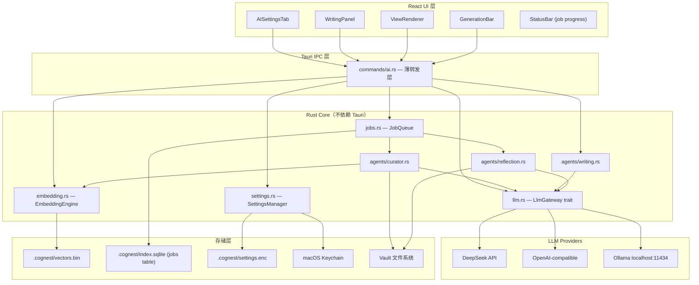
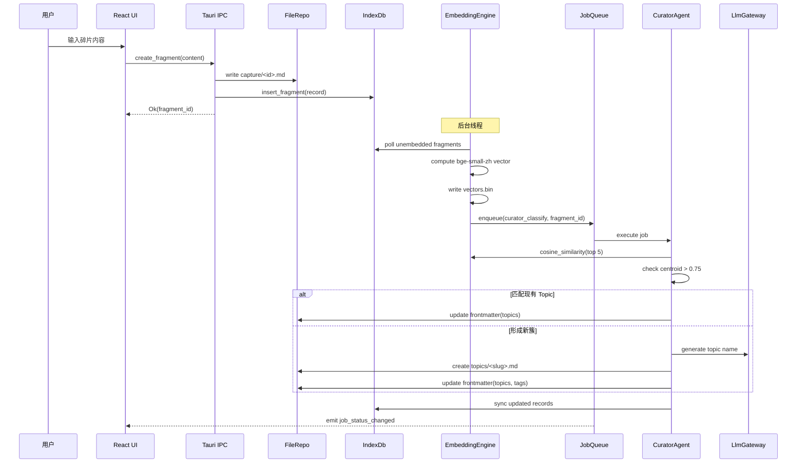
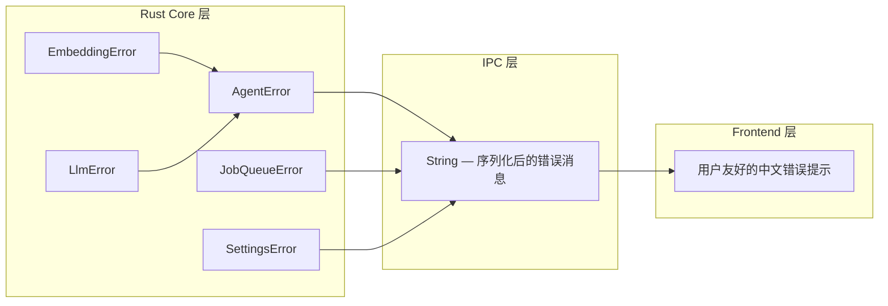

# Design Document

## Overview

本文档是 Cognest Phase 2 AI 能力层的技术设计，覆盖 9 大需求的实现细节。Phase 1 已交付单机 MVP（碎片/文章 CRUD、FTS5 搜索、Git 同步、TipTap 编辑器、ViewStack 导航），Phase 2 在此基础上引入本地 Embedding、LLM Gateway、Agent 流水线、Job Queue、生成式视图渲染和数据隐私保护。

**设计目标：**
- Embedding 100% 本地计算（fastembed-rs + bge-small-zh-v1.5）
- LLM Generation 云端为主（DeepSeek 首选），Ollama 本地兜底
- Agent = 后台 Job，不是常驻角色
- 聚类用向量算法（本地免费），LLM 只做命名/综述
- Rust Core 不 import Tauri 类型（纯 Rust crate）
- 无 tokio runtime in setup()——background tasks 用 std::thread::spawn

**新增依赖（Rust）：**
- `fastembed` — 本地 Embedding 推理
- `security-framework` — macOS Keychain 访问
- `reqwest` — HTTP 客户端（LLM API 调用）
- `futures` / `tokio-stream` — 流式响应处理

**新增依赖（Frontend）：**
- `@xyflow/react` (react-flow) — 知识图谱渲染
- `recharts` — 统计图表
- `react-markdown` — summary 类型视图渲染

---

## Architecture

### 系统分层架构



### 数据流：碎片入库到 AI 处理



### 线程模型

```
Main Thread (Tauri UI)
│
├── std::thread #1: EmbeddingEngine background batch
│   └── poll unembedded → compute → write vectors.bin → enqueue curator job
│
├── std::thread #2: JobQueue Worker A
│   └── dequeue job → execute agent → write result → emit event
│
├── std::thread #3: JobQueue Worker B
│   └── (同上，最多 2 个并发 worker)
│
└── std::thread #4: Reflection scheduler
    └── sleep until 22:00 → enqueue reflection_daily/weekly
```

**关键约束：** Tauri v2 的 `setup()` 中无 tokio runtime 可用，所有后台任务通过 `std::thread::spawn` 启动。IPC commands 中可使用 `#[tauri::command(async)]` 配合 tokio 做异步 I/O（HTTP 请求等）。

---

## Components and Interfaces

### 1. EmbeddingEngine（embedding.rs）

```rust
use std::path::{Path, PathBuf};
use std::sync::{Arc, Mutex};

/// 向量缓存文件格式：[fragment_id: 8 bytes hash][vector: 512 * f32 = 2048 bytes]
/// 每条记录固定 2056 bytes，支持 mmap 随机读取

/// Embedding 计算引擎
pub struct EmbeddingEngine {
    model: fastembed::TextEmbedding,
    cache_path: PathBuf,
    cache: VectorCache,
}

/// 向量缓存（内存映射 + 索引）
pub struct VectorCache {
    /// fragment_id → offset in vectors.bin
    index: HashMap<String, u64>,
    file_path: PathBuf,
}

/// Embedding 相关错误
#[derive(Debug, thiserror::Error)]
pub enum EmbeddingError {
    #[error("模型加载失败: {0}")]
    ModelLoad(String),

    #[error("模型文件校验失败，期望 SHA-256: {expected}")]
    IntegrityCheck { expected: String },

    #[error("模型下载超时 ({timeout_secs}s)")]
    DownloadTimeout { timeout_secs: u64 },

    #[error("向量未计算: fragment {fragment_id}")]
    VectorMissing { fragment_id: String },

    #[error("推理失败: {0}")]
    Inference(String),

    #[error("IO 错误: {0}")]
    Io(#[from] std::io::Error),
}

/// 批处理进度报告
#[derive(Debug, Clone, serde::Serialize)]
pub struct BatchProgress {
    pub completed: u64,
    pub total: u64,
}

impl EmbeddingEngine {
    /// 初始化引擎，验证模型完整性
    pub fn new(model_dir: &Path, cache_path: &Path) -> Result<Self, EmbeddingError>;

    /// 计算单条文本的 embedding（512-d float32）
    /// 超过 512 tokens 自动截断
    pub fn embed_text(&self, text: &str) -> Result<Vec<f32>, EmbeddingError>;

    /// 批量计算 embedding（后台线程调用）
    /// 返回 Receiver 用于进度监听
    pub fn embed_batch(
        &self,
        fragments: Vec<(String, String)>, // (id, content)
    ) -> Result<BatchProgress, EmbeddingError>;

    /// 从缓存读取向量
    pub fn get_vector(&self, fragment_id: &str) -> Result<Vec<f32>, EmbeddingError>;

    /// 计算两个 fragment 的余弦相似度
    pub fn cosine_similarity(
        &self,
        id_a: &str,
        id_b: &str,
    ) -> Result<f32, EmbeddingError>;

    /// 查找与目标最相似的 top-k fragments
    pub fn find_similar(
        &self,
        target_id: &str,
        candidates: &[String],
        top_k: usize,
    ) -> Result<Vec<(String, f32)>, EmbeddingError>;

    /// 计算一组向量的质心（用于 topic clustering）
    pub fn compute_centroid(vectors: &[Vec<f32>]) -> Vec<f32>;

    /// 检查哪些 fragment 尚未计算向量
    pub fn find_unembedded(&self, all_ids: &[String]) -> Vec<String>;
}
```

### 2. LlmGateway（llm.rs）

```rust
use std::pin::Pin;
use futures::Stream;
use serde::{Deserialize, Serialize};

// ─── Core Types ─────────────────────────────────────────────────────────────

/// 聊天消息角色
#[derive(Debug, Clone, Serialize, Deserialize)]
#[serde(rename_all = "lowercase")]
pub enum Role {
    System,
    User,
    Assistant,
}

/// 单条聊天消息
#[derive(Debug, Clone, Serialize, Deserialize)]
pub struct ChatMessage {
    pub role: Role,
    pub content: String,
}

/// LLM 调用选项
#[derive(Debug, Clone, Serialize, Deserialize)]
pub struct ChatOptions {
    pub model: Option<String>,
    pub temperature: Option<f32>,
    pub max_tokens: Option<u32>,
    /// 结构化输出 JSON Schema（可选）
    pub json_schema: Option<serde_json::Value>,
    /// 请求超时（秒），默认 30
    pub timeout_secs: Option<u64>,
}

/// 完整响应
#[derive(Debug, Clone, Serialize, Deserialize)]
pub struct LlmResponse {
    pub content: String,
    pub finish_reason: FinishReason,
    pub usage: TokenUsage,
}

/// 流式响应块
#[derive(Debug, Clone, Serialize, Deserialize)]
#[serde(tag = "type")]
pub enum StreamChunk {
    /// 增量内容
    Delta { content: String },
    /// 流结束摘要
    Done { usage: TokenUsage },
    /// 流中断错误
    Error { error: LlmError, partial_tokens: u32 },
}

/// Token 用量统计
#[derive(Debug, Clone, Serialize, Deserialize)]
pub struct TokenUsage {
    pub prompt_tokens: u32,
    pub completion_tokens: u32,
    pub total_tokens: u32,
}

/// 完成原因
#[derive(Debug, Clone, Serialize, Deserialize)]
#[serde(rename_all = "snake_case")]
pub enum FinishReason {
    Stop,
    Length,
    ContentFilter,
}

// ─── Error Types ────────────────────────────────────────────────────────────

/// LLM 错误分类
#[derive(Debug, Clone, Serialize, Deserialize, thiserror::Error)]
pub enum LlmError {
    #[error("[{provider}] 请求超时")]
    Timeout { provider: String },

    #[error("[{provider}] 速率限制")]
    RateLimit { provider: String },

    #[error("[{provider}] 认证失败")]
    AuthFailure { provider: String },

    #[error("[{provider}] 网络错误: {reason}")]
    NetworkError { provider: String, reason: String },

    #[error("无可用 Provider，请在设置中配置")]
    NoProvider,

    #[error("结构化输出验证失败: {details}")]
    SchemaValidation { details: String },

    #[error("[{provider}] 未知错误: {reason}")]
    Unknown { provider: String, reason: String },
}

// ─── Trait Definition ───────────────────────────────────────────────────────

/// LLM Gateway 统一 trait
/// 所有 Provider 必须实现此 trait
pub trait LlmProvider: Send + Sync {
    /// 供应商名称标识
    fn name(&self) -> &str;

    /// 同步聊天调用
    fn chat(
        &self,
        messages: &[ChatMessage],
        options: &ChatOptions,
    ) -> Result<LlmResponse, LlmError>;

    /// 流式聊天调用
    fn stream_chat(
        &self,
        messages: &[ChatMessage],
        options: &ChatOptions,
    ) -> Result<Pin<Box<dyn Stream<Item = StreamChunk> + Send>>, LlmError>;

    /// 验证连接（轻量测试调用）
    fn validate(&self) -> Result<(), LlmError>;
}

/// Gateway 管理多个 Provider 的路由
pub struct LlmGateway {
    providers: Vec<Box<dyn LlmProvider>>,
    default_provider: Option<String>,
    /// Agent → Provider 名称映射
    agent_overrides: HashMap<String, String>,
}

impl LlmGateway {
    /// 从加密配置文件加载
    pub fn from_config(settings: &SettingsManager) -> Result<Self, LlmError>;

    /// 热重载配置（设置保存后 2s 内生效）
    pub fn reload(&mut self, settings: &SettingsManager) -> Result<(), LlmError>;

    /// 为指定 Agent 路由到对应 Provider
    pub fn chat_for_agent(
        &self,
        agent: &str,
        messages: &[ChatMessage],
        options: &ChatOptions,
    ) -> Result<LlmResponse, LlmError>;

    /// 流式版本
    pub fn stream_for_agent(
        &self,
        agent: &str,
        messages: &[ChatMessage],
        options: &ChatOptions,
    ) -> Result<Pin<Box<dyn Stream<Item = StreamChunk> + Send>>, LlmError>;
}
```

### 3. LLM Provider 实现（llm/ 目录）

```rust
// ─── llm/deepseek.rs ────────────────────────────────────────────────────────

pub struct DeepSeekProvider {
    client: reqwest::Client,
    endpoint: String,      // https://api.deepseek.com
    api_key: String,
    model: String,         // deepseek-chat
}

impl LlmProvider for DeepSeekProvider { /* ... */ }

// ─── llm/ollama.rs ──────────────────────────────────────────────────────────

pub struct OllamaProvider {
    client: reqwest::Client,
    endpoint: String,      // http://localhost:11434
    model: String,         // 用户选择的本地模型
}

impl OllamaProvider {
    /// 查询可用模型列表（GET /api/tags）
    pub fn list_models(&self) -> Result<Vec<String>, LlmError>;
}

impl LlmProvider for OllamaProvider { /* ... */ }

// ─── llm/openai_compat.rs ───────────────────────────────────────────────────

/// 兼容 OpenAI API 格式的通用 Provider
/// 适配 Moonshot / 智谱 / 其他兼容服务
pub struct OpenAiCompatProvider {
    client: reqwest::Client,
    endpoint: String,
    api_key: String,
    model: String,
}

impl LlmProvider for OpenAiCompatProvider { /* ... */ }
```

### 4. SettingsManager（settings.rs）

```rust
use serde::{Deserialize, Serialize};

/// Provider 配置（不含明文 API Key）
#[derive(Debug, Clone, Serialize, Deserialize)]
pub struct ProviderConfig {
    pub id: String,
    pub name: String,
    pub provider_type: ProviderType,
    pub endpoint: String,
    pub model: String,
    pub temperature: f32,
    pub enabled: bool,
}

#[derive(Debug, Clone, Serialize, Deserialize)]
#[serde(rename_all = "lowercase")]
pub enum ProviderType {
    DeepSeek,
    Ollama,
    OpenAiCompat,
}

/// Agent → Provider 路由配置
#[derive(Debug, Clone, Serialize, Deserialize)]
pub struct AgentRouting {
    pub default_provider: Option<String>,
    pub overrides: HashMap<String, String>, // agent_name → provider_id
}

/// 设置管理器
pub struct SettingsManager {
    config_path: PathBuf,    // .cognest/settings.enc
}

impl SettingsManager {
    pub fn new(vault_path: &Path) -> Self;

    /// 加载配置（解密 .enc 文件）
    pub fn load(&self) -> Result<AppSettings, SettingsError>;

    /// 保存配置（加密写入）
    pub fn save(&self, settings: &AppSettings) -> Result<(), SettingsError>;

    /// 从 macOS Keychain 读取 API Key
    pub fn get_api_key(&self, provider_id: &str) -> Result<Option<String>, SettingsError>;

    /// 写入 API Key 到 macOS Keychain
    pub fn set_api_key(&self, provider_id: &str, key: &str) -> Result<(), SettingsError>;

    /// 从 macOS Keychain 删除 API Key
    pub fn delete_api_key(&self, provider_id: &str) -> Result<(), SettingsError>;
}

/// 完整应用设置（序列化到 .enc 文件，不含 API Key 明文）
#[derive(Debug, Clone, Serialize, Deserialize)]
pub struct AppSettings {
    pub providers: Vec<ProviderConfig>,
    pub routing: AgentRouting,
}

#[derive(Debug, thiserror::Error)]
pub enum SettingsError {
    #[error("配置文件不存在或不可读")]
    NotFound,
    #[error("解密失败")]
    DecryptionFailed,
    #[error("Keychain 访问失败: {0}")]
    KeychainError(String),
    #[error("序列化错误: {0}")]
    Serialization(String),
    #[error("IO 错误: {0}")]
    Io(#[from] std::io::Error),
}
```

### 5. JobQueue（jobs.rs）

```rust
use std::sync::{Arc, Mutex};
use std::thread;
use std::time::Duration;

/// Job 状态枚举
#[derive(Debug, Clone, Serialize, Deserialize, PartialEq)]
#[serde(rename_all = "lowercase")]
pub enum JobStatus {
    Pending,
    Running,
    Completed,
    Failed,
    Blocked, // LLM Provider 不可用时暂停
}

/// Job 类型枚举
#[derive(Debug, Clone, Serialize, Deserialize)]
#[serde(rename_all = "snake_case")]
pub enum JobType {
    CuratorClassify,
    CuratorRecluster,
    WritingContext,
    ReflectionDaily,
    ReflectionWeekly,
}

/// 持久化 Job 记录
#[derive(Debug, Clone, Serialize, Deserialize)]
pub struct JobRecord {
    pub id: String,
    pub job_type: JobType,
    pub status: JobStatus,
    pub payload: serde_json::Value,
    pub result: Option<serde_json::Value>,
    pub created_at: String,
    pub started_at: Option<String>,
    pub completed_at: Option<String>,
    pub retry_count: u32,
    pub progress: Option<u8>, // 0-100
}

/// Job 状态变更事件（发送到前端）
#[derive(Debug, Clone, Serialize)]
pub struct JobStatusEvent {
    pub job_id: String,
    pub status: JobStatus,
    pub progress: Option<u8>,
}

/// Job 失败事件
#[derive(Debug, Clone, Serialize)]
pub struct JobFailedEvent {
    pub job_id: String,
    pub job_type: JobType,
    pub reason: String,
}

/// Job Queue 管理器
pub struct JobQueue {
    db: Arc<Mutex<rusqlite::Connection>>,
    /// Tauri 事件发射器（通过回调抽象，不依赖 Tauri 类型）
    event_emitter: Box<dyn Fn(&str, &str) + Send + Sync>,
    max_workers: usize, // 固定为 2
}

impl JobQueue {
    /// 初始化 Queue，创建 jobs 表
    pub fn new(
        db: Arc<Mutex<rusqlite::Connection>>,
        event_emitter: Box<dyn Fn(&str, &str) + Send + Sync>,
    ) -> Self;

    /// 启动时：running → pending，重新入队所有 pending jobs
    pub fn recover_on_startup(&self) -> Result<u32, JobQueueError>;

    /// 入队新 job
    pub fn enqueue(&self, job_type: JobType, payload: serde_json::Value) -> Result<String, JobQueueError>;

    /// 启动 worker 线程（最多 2 个）
    pub fn start_workers(&self, context: WorkerContext);

    /// 获取当前队列状态（前端展示用）
    pub fn list_jobs(&self, limit: u32) -> Result<Vec<JobRecord>, JobQueueError>;

    /// 取消一个 pending/blocked job
    pub fn cancel_job(&self, job_id: &str) -> Result<(), JobQueueError>;
}

/// Worker 执行上下文（注入 Agent 依赖）
pub struct WorkerContext {
    pub embedding: Arc<EmbeddingEngine>,
    pub llm: Arc<Mutex<LlmGateway>>,
    pub repo: Arc<Mutex<FileRepo>>,
    pub index: Arc<Mutex<IndexDb>>,
}

/// 指数退避重试参数：5s, 25s, 125s（基数 5，指数 2）
const RETRY_DELAYS: [Duration; 3] = [
    Duration::from_secs(5),
    Duration::from_secs(25),
    Duration::from_secs(125),
];

/// 单 job 执行超时
const JOB_TIMEOUT: Duration = Duration::from_secs(300);
```

### 6. Agent Trait 与实现（agents/）

```rust
// ─── agents/mod.rs ──────────────────────────────────────────────────────────

/// Agent 统一 trait
pub trait Agent: Send + Sync {
    /// Agent 名称
    fn name(&self) -> &str;

    /// 执行 Job（由 Worker 调用）
    fn execute(
        &self,
        payload: &serde_json::Value,
        context: &WorkerContext,
    ) -> Result<serde_json::Value, AgentError>;
}

#[derive(Debug, thiserror::Error)]
pub enum AgentError {
    #[error("Embedding 错误: {0}")]
    Embedding(#[from] EmbeddingError),
    #[error("LLM 错误: {0}")]
    Llm(#[from] LlmError),
    #[error("文件操作错误: {0}")]
    Repo(String),
    #[error("执行超时")]
    Timeout,
}
```

```rust
// ─── agents/curator.rs ──────────────────────────────────────────────────────

pub struct CuratorAgent;

impl CuratorAgent {
    /// 分类单个碎片：查相似 → 检查 topic centroid → 分配/创建 topic → 打标签
    fn classify_fragment(
        &self,
        fragment_id: &str,
        context: &WorkerContext,
    ) -> Result<ClassifyResult, AgentError>;

    /// 全量重聚类：对所有 uncategorized fragments 执行 k-means 风格聚类
    fn recluster(
        &self,
        context: &WorkerContext,
    ) -> Result<ReclusterResult, AgentError>;
}

#[derive(Debug, Serialize)]
pub struct ClassifyResult {
    pub fragment_id: String,
    pub assigned_topic: Option<String>,
    pub new_topic_created: bool,
    pub tags: Vec<String>,
}

impl Agent for CuratorAgent {
    fn name(&self) -> &str { "curator" }
    fn execute(&self, payload: &serde_json::Value, context: &WorkerContext)
        -> Result<serde_json::Value, AgentError> { /* dispatch by job_type */ }
}
```

```rust
// ─── agents/writing.rs ──────────────────────────────────────────────────────

pub struct WritingAgent;

impl WritingAgent {
    /// 构建写作上下文：文章内容 + 相关碎片 + 历史消息
    fn build_context(
        &self,
        article_id: &str,
        history: &[ChatMessage],
        context: &WorkerContext,
    ) -> Result<Vec<ChatMessage>, AgentError>;

    /// 执行写作辅助请求（非 Job，直接 IPC 调用）
    pub fn chat(
        &self,
        article_content: &str,
        user_message: &str,
        history: &[ChatMessage],
        context: &WorkerContext,
    ) -> Result<LlmResponse, AgentError>;

    /// 流式写作辅助
    pub fn stream_chat(
        &self,
        article_content: &str,
        user_message: &str,
        history: &[ChatMessage],
        context: &WorkerContext,
    ) -> Result<Pin<Box<dyn Stream<Item = StreamChunk> + Send>>, AgentError>;

    /// 推荐相关素材
    pub fn recommend_fragments(
        &self,
        article_content: &str,
        context: &WorkerContext,
        limit: usize,
    ) -> Result<Vec<(String, f32)>, AgentError>;
}

impl Agent for WritingAgent {
    fn name(&self) -> &str { "writing" }
    fn execute(&self, payload: &serde_json::Value, context: &WorkerContext)
        -> Result<serde_json::Value, AgentError> { /* preload context job */ }
}
```

```rust
// ─── agents/reflection.rs ───────────────────────────────────────────────────

pub struct ReflectionAgent;

impl ReflectionAgent {
    /// 生成每日回顾卡片
    fn daily_review(&self, context: &WorkerContext) -> Result<ViewSpec, AgentError>;

    /// 生成每周回顾卡片
    fn weekly_review(&self, context: &WorkerContext) -> Result<ViewSpec, AgentError>;

    /// 检查是否有遗漏的回顾（App 启动时调用）
    pub fn check_missed_reviews(
        &self,
        context: &WorkerContext,
    ) -> Result<Vec<JobType>, AgentError>;
}

impl Agent for ReflectionAgent {
    fn name(&self) -> &str { "reflection" }
    fn execute(&self, payload: &serde_json::Value, context: &WorkerContext)
        -> Result<serde_json::Value, AgentError> { /* daily or weekly */ }
}

/// Reflection 调度器（独立线程）
pub struct ReflectionScheduler {
    queue: Arc<JobQueue>,
}

impl ReflectionScheduler {
    /// 启动调度线程：sleep until 22:00，检查并入队
    pub fn start(self);
}
```

### 7. IPC Commands 扩展（commands/ai.rs）

```rust
// 新增 IPC 命令，遵循现有 thin-forwarding 模式

// ─── Embedding Commands ─────────────────────────────────────────────────────

#[tauri::command]
pub fn get_embedding_status(state: State<'_, AiState>) -> Result<EmbeddingStatus, String>;

#[tauri::command]
pub fn find_similar_fragments(
    state: State<'_, AiState>,
    fragment_id: String,
    limit: Option<usize>,
) -> Result<Vec<SimilarFragment>, String>;

// ─── Writing Agent Commands ─────────────────────────────────────────────────

#[tauri::command(async)]
pub async fn writing_chat(
    state: State<'_, AiState>,
    article_id: String,
    message: String,
    history: Vec<ChatMessage>,
) -> Result<String, String>;

#[tauri::command(async)]
pub async fn writing_stream_chat(
    state: State<'_, AiState>,
    app: tauri::AppHandle,
    article_id: String,
    message: String,
    history: Vec<ChatMessage>,
) -> Result<(), String>;
// 通过 Tauri event "writing_chunk" 流式推送

#[tauri::command]
pub fn writing_recommend(
    state: State<'_, AiState>,
    article_content: String,
    limit: Option<usize>,
) -> Result<Vec<SimilarFragment>, String>;

// ─── View Generation Commands ───────────────────────────────────────────────

#[tauri::command(async)]
pub async fn generate_view(
    state: State<'_, AiState>,
    prompt: String,
) -> Result<ViewSpec, String>;

#[tauri::command]
pub fn pin_view(
    state: State<'_, AiState>,
    view_spec: ViewSpec,
) -> Result<(), String>;

#[tauri::command]
pub fn list_pinned_views(
    state: State<'_, AiState>,
) -> Result<Vec<ViewSpec>, String>;

// ─── Settings Commands ──────────────────────────────────────────────────────

#[tauri::command]
pub fn get_ai_settings(state: State<'_, AiState>) -> Result<AppSettings, String>;

#[tauri::command]
pub fn save_ai_settings(
    state: State<'_, AiState>,
    settings: AppSettings,
    api_keys: HashMap<String, String>, // provider_id → key
) -> Result<(), String>;

#[tauri::command(async)]
pub async fn validate_provider(
    state: State<'_, AiState>,
    provider: ProviderConfig,
    api_key: String,
) -> Result<bool, String>;

#[tauri::command(async)]
pub async fn list_ollama_models(
    state: State<'_, AiState>,
    endpoint: String,
) -> Result<Vec<String>, String>;

// ─── Job Queue Commands ─────────────────────────────────────────────────────

#[tauri::command]
pub fn list_jobs(
    state: State<'_, AiState>,
    limit: Option<u32>,
) -> Result<Vec<JobRecord>, String>;

#[tauri::command]
pub fn cancel_job(
    state: State<'_, AiState>,
    job_id: String,
) -> Result<(), String>;

// ─── Privacy / Audit Commands ───────────────────────────────────────────────

#[tauri::command]
pub fn get_audit_log(
    state: State<'_, AiState>,
    limit: Option<u32>,
) -> Result<Vec<AuditRecord>, String>;
```

**AiState 扩展 AppState：**

```rust
pub struct AiState {
    pub embedding: Arc<EmbeddingEngine>,
    pub llm: Arc<Mutex<LlmGateway>>,
    pub jobs: Arc<JobQueue>,
    pub settings: Arc<Mutex<SettingsManager>>,
}
```

### 8. Frontend — TypeScript 接口定义

```typescript
// ─── stores/settingsStore.ts ────────────────────────────────────────────────

interface ProviderConfig {
  id: string;
  name: string;
  providerType: 'deepseek' | 'ollama' | 'openai_compat';
  endpoint: string;
  model: string;
  temperature: number;
  enabled: boolean;
}

interface AgentRouting {
  defaultProvider: string | null;
  overrides: Record<string, string>; // agent_name → provider_id
}

interface AiSettings {
  providers: ProviderConfig[];
  routing: AgentRouting;
}

interface SettingsStore {
  settings: AiSettings | null;
  loading: boolean;
  error: string | null;

  loadSettings: () => Promise<void>;
  saveSettings: (settings: AiSettings, apiKeys: Record<string, string>) => Promise<void>;
  validateProvider: (provider: ProviderConfig, apiKey: string) => Promise<boolean>;
  listOllamaModels: (endpoint: string) => Promise<string[]>;
}

// ─── stores/writingStore.ts ─────────────────────────────────────────────────

interface ChatMessage {
  id: string;
  role: 'user' | 'assistant';
  content: string;
  timestamp: string;
  streaming?: boolean;
}

interface RecommendedFragment {
  id: string;
  content: string;
  similarity: number;
  tags: string[];
}

interface WritingStore {
  messages: ChatMessage[];
  streaming: boolean;
  error: string | null;
  panelOpen: boolean;
  recommendedFragments: RecommendedFragment[];

  togglePanel: () => void;
  sendMessage: (articleId: string, message: string) => Promise<void>;
  streamMessage: (articleId: string, message: string) => void;
  retryLast: () => void;
  quickAction: (action: 'outline' | 'expand' | 'recommend', articleContent: string) => void;
  loadRecommendations: (articleContent: string) => Promise<void>;
  clearHistory: () => void;
}

// ─── stores/viewStore.ts ────────────────────────────────────────────────────

interface ViewSpec {
  id: string;
  type: 'graph' | 'timeline' | 'list' | 'chart' | 'summary';
  title: string;
  query: string;
  created: string;
  pinned: boolean;
  config: Record<string, unknown>;
  data: ViewData;
}

type ViewData =
  | GraphData
  | TimelineData
  | ListData
  | ChartData
  | SummaryData;

interface GraphData {
  nodes: GraphNode[];
  edges: GraphEdge[];
}

interface GraphNode {
  id: string;
  label: string;
  type: 'topic' | 'fragment' | 'article';
  size?: number;
}

interface GraphEdge {
  source: string;
  target: string;
  label?: string;
  weight?: number;
}

interface TimelineData {
  items: TimelineItem[];
}

interface TimelineItem {
  id: string;
  date: string;
  title: string;
  content: string;
  type: 'fragment' | 'topic' | 'article';
}

interface ListData {
  items: ListItem[];
  groupBy?: string;
}

interface ListItem {
  id: string;
  title: string;
  subtitle?: string;
  tags?: string[];
}

interface ChartData {
  chartType: 'bar' | 'line' | 'pie' | 'area';
  series: ChartSeries[];
  xAxis?: { label: string; data: string[] };
}

interface ChartSeries {
  name: string;
  data: number[];
  color?: string;
}

interface SummaryData {
  markdown: string;
  stats?: Record<string, number | string>;
}

interface ViewStore {
  currentView: ViewSpec | null;
  pinnedViews: ViewSpec[];
  generating: boolean;
  error: string | null;
  prompt: string;

  setPrompt: (prompt: string) => void;
  generateView: (prompt: string) => Promise<void>;
  pinView: (view: ViewSpec) => Promise<void>;
  unpinView: (viewId: string) => Promise<void>;
  loadPinnedViews: () => Promise<void>;
  clearCurrent: () => void;
}
```

### 9. Frontend 组件设计

#### WritingPanel.tsx

```
┌─────────────────────────────┐
│ ✨ Writing Agent    [折叠▶] │  ← 320px 可折叠面板
├─────────────────────────────┤
│ [消息气泡区域，支持滚动]      │
│                             │
│  User: 帮我扩展第二段...      │
│  AI: (streaming...)         │
│                             │
├─────────────────────────────┤
│ [推荐结构] [扩展段落] [推荐素材] │ ← quick actions
├─────────────────────────────┤
│ [输入框...           ] [发送] │
└─────────────────────────────┘
```

与现有 `Compose.tsx` 的 `.ai-side` div 对应，替换当前占位内容。

#### ViewRenderer.tsx

```typescript
// 根据 ViewSpec.type 分发到对应组件
function ViewRenderer({ spec }: { spec: ViewSpec }) {
  switch (spec.type) {
    case 'graph':
      return <GraphView data={spec.data as GraphData} config={spec.config} />;
    case 'timeline':
      return <TimelineView data={spec.data as TimelineData} />;
    case 'list':
      return <ListView data={spec.data as ListData} />;
    case 'chart':
      return <ChartView data={spec.data as ChartData} />;
    case 'summary':
      return <SummaryView data={spec.data as SummaryData} />;
    default:
      return <ErrorState message="不支持的视图类型" />;
  }
}
```

#### GenerationBar.tsx

嵌入 Discover 页面顶部，提供自然语言输入框生成 View_Spec：

```
┌──────────────────────────────────────────────────────┐
│ 🔮 输入描述生成视图…                           [生成]  │
└──────────────────────────────────────────────────────┘
```

#### AISettingsTab.tsx

作为 SettingsModal 的新 tab（id: 'ai'，label: 'AI 模型'），添加到现有 TABS 数组：

```
┌─────────────────────────────────────────────────────────┐
│ AI 模型                                                 │
├─────────────────────────────────────────────────────────┤
│ ┌─ Provider 列表 ─────────────────────────────────────┐ │
│ │ ☑ DeepSeek    api.deepseek.com   ····5a3b  [测试] │ │
│ │ ☑ Ollama      localhost:11434    qwen2.5   [刷新] │ │
│ │ ☐ OpenAI      api.openai.com    ····       [测试] │ │
│ └───────────────────────────────────────────────────┘ │
│ [+ 添加 Provider]                                      │
│                                                        │
│ ┌─ Agent 路由 ────────────────────────────────────────┐ │
│ │ 默认: DeepSeek ▾                                   │ │
│ │ Curator: Ollama ▾                                  │ │
│ │ Writing: DeepSeek ▾                                │ │
│ │ Reflection: DeepSeek ▾                             │ │
│ └───────────────────────────────────────────────────┘ │
│                                                        │
│ ⚠️ 隐私说明                                            │
│ Embedding 始终本地计算。云端 Provider 仅接收分类/写作/    │
│ 视图生成相关的碎片内容（每次最多 20 条 / 8000 tokens）。   │
│ 如使用 Ollama，所有数据留在本地。                        │
└─────────────────────────────────────────────────────────┘
```

---

## Data Models

### SQLite Schema 新增表

```sql
-- ─── Jobs 表（Job Queue 持久化） ────────────────────────────────────────────

CREATE TABLE IF NOT EXISTS jobs (
    id TEXT PRIMARY KEY,
    job_type TEXT NOT NULL,       -- curator_classify | curator_recluster | writing_context | reflection_daily | reflection_weekly
    status TEXT NOT NULL DEFAULT 'pending',  -- pending | running | completed | failed | blocked
    payload TEXT NOT NULL,        -- JSON: 输入参数
    result TEXT,                  -- JSON: 输出结果（完成后填入）
    created_at TEXT NOT NULL,
    started_at TEXT,
    completed_at TEXT,
    retry_count INTEGER NOT NULL DEFAULT 0,
    progress INTEGER,            -- 0-100 百分比（running 状态时更新）
    error_message TEXT           -- 失败时记录错误信息
);

CREATE INDEX idx_jobs_status ON jobs(status);
CREATE INDEX idx_jobs_created ON jobs(created_at);

-- ─── Audit Log 表（隐私审计） ───────────────────────────────────────────────

CREATE TABLE IF NOT EXISTS audit_log (
    id INTEGER PRIMARY KEY AUTOINCREMENT,
    timestamp TEXT NOT NULL,
    provider_name TEXT NOT NULL,
    operation TEXT NOT NULL,      -- classify | write_chat | generate_view | reflection
    token_count INTEGER NOT NULL,
    fragment_count INTEGER,       -- 本次发送了多少条碎片
    success INTEGER NOT NULL DEFAULT 1
);

CREATE INDEX idx_audit_timestamp ON audit_log(timestamp);

-- ─── Embedding 元数据表 ─────────────────────────────────────────────────────

CREATE TABLE IF NOT EXISTS embedding_meta (
    fragment_id TEXT PRIMARY KEY,
    computed_at TEXT NOT NULL,
    model_version TEXT NOT NULL,  -- bge-small-zh-v1.5
    vector_offset INTEGER NOT NULL -- offset in vectors.bin
);

-- ─── 扩展 fragments 表添加 ai_processed 标记 ────────────────────────────────

ALTER TABLE fragments ADD COLUMN ai_processed INTEGER NOT NULL DEFAULT 0;
-- 0 = 未处理, 1 = 已处理
```

### vectors.bin 文件格式

```
┌─────────────────────────────────────────────────────┐
│ Header (64 bytes)                                   │
│   magic: "CVEC" (4 bytes)                           │
│   version: u32 (4 bytes) = 1                        │
│   dimension: u32 (4 bytes) = 512                    │
│   count: u64 (8 bytes)                              │
│   reserved: 44 bytes                                │
├─────────────────────────────────────────────────────┤
│ Record 0                                            │
│   fragment_id_hash: [u8; 8] (8 bytes, SHA-256前8字节)│
│   vector: [f32; 512] (2048 bytes)                   │
│   Total: 2056 bytes per record                      │
├─────────────────────────────────────────────────────┤
│ Record 1                                            │
│   ...                                               │
├─────────────────────────────────────────────────────┤
│ ...                                                 │
└─────────────────────────────────────────────────────┘
```

单条 embedding 2056 bytes → 10,000 条碎片约 20MB，可接受。

### View_Spec JSON Schema

```json
{
  "$schema": "http://json-schema.org/draft-07/schema#",
  "title": "ViewSpec",
  "type": "object",
  "required": ["id", "type", "title", "query", "created", "pinned", "config", "data"],
  "properties": {
    "id": { "type": "string", "format": "uuid" },
    "type": {
      "type": "string",
      "enum": ["graph", "timeline", "list", "chart", "summary"]
    },
    "title": { "type": "string", "maxLength": 100 },
    "query": { "type": "string", "maxLength": 500 },
    "created": { "type": "string", "format": "date-time" },
    "pinned": { "type": "boolean" },
    "config": {
      "type": "object",
      "properties": {
        "layout": { "type": "string" },
        "highlight": { "type": "array", "items": { "type": "string" } },
        "timeRange": { "type": "string" },
        "groupBy": { "type": "string" }
      }
    },
    "data": {
      "oneOf": [
        {
          "type": "object",
          "required": ["nodes", "edges"],
          "properties": {
            "nodes": {
              "type": "array",
              "maxItems": 200,
              "items": {
                "type": "object",
                "required": ["id", "label", "type"],
                "properties": {
                  "id": { "type": "string" },
                  "label": { "type": "string" },
                  "type": { "enum": ["topic", "fragment", "article"] },
                  "size": { "type": "number" }
                }
              }
            },
            "edges": {
              "type": "array",
              "items": {
                "type": "object",
                "required": ["source", "target"],
                "properties": {
                  "source": { "type": "string" },
                  "target": { "type": "string" },
                  "label": { "type": "string" },
                  "weight": { "type": "number" }
                }
              }
            }
          }
        },
        {
          "type": "object",
          "required": ["markdown"],
          "properties": {
            "markdown": { "type": "string" },
            "stats": { "type": "object" }
          }
        }
      ]
    }
  }
}
```

### settings.enc 加密格式

```
┌─────────────────────────────┐
│ magic: "CSET" (4 bytes)     │
│ version: u8 = 1             │
│ nonce: [u8; 12]             │  ← AES-256-GCM nonce
│ ciphertext: variable        │  ← 加密后的 JSON (AppSettings)
│ tag: [u8; 16]               │  ← GCM authentication tag
└─────────────────────────────┘
```

加密密钥派生：从 macOS Keychain 存储的 master secret 通过 HKDF-SHA256 派生 AES-256 key。
API Key 不存在此文件中，直接存 Keychain（service: "com.cognest.provider.{id}"）。

### Tauri Events 新增

| 事件名 | Payload | 触发时机 |
|--------|---------|----------|
| `job_status_changed` | `{ job_id, status, progress? }` | Job 状态变更 |
| `job_failed` | `{ job_id, job_type, reason }` | Job 重试耗尽 |
| `provider_needed` | `{ job_id }` | 无可用 Provider |
| `writing_chunk` | `{ content }` | Writing Agent 流式推送 |
| `new_feed_card` | `{ view_id }` | Reflection 生成新卡片 |
| `embedding_progress` | `{ completed, total }` | 批量 Embedding 进度 |

---

## Error Handling

### 错误分层策略



### 错误处理规则

1. **Rust Core 层：** 使用 `thiserror` 定义类型化错误，保留完整上下文
2. **IPC 层：** 所有错误转换为 `Result<T, String>`（Tauri command 限制），错误消息保留分类信息
3. **Frontend 层：** 解析错误字符串，映射到用户友好提示

### LLM 调用错误处理

```rust
/// LLM 错误处理策略
match llm_result {
    Err(LlmError::Timeout { .. }) => {
        // Job Queue: 计入 retry，指数退避
        // Writing Agent: 前端显示"请求超时，请重试"
    }
    Err(LlmError::RateLimit { .. }) => {
        // Job Queue: 固定等待 60s 后重试
        // Writing Agent: 前端显示"请求过于频繁"
    }
    Err(LlmError::AuthFailure { .. }) => {
        // Job Queue: 标记 blocked，emit provider_needed
        // Writing Agent: 前端引导到设置页
    }
    Err(LlmError::NoProvider) => {
        // 所有场景: emit provider_needed，前端引导配置
    }
    Err(LlmError::SchemaValidation { .. }) => {
        // Curator/Reflection: 使用 fallback（占位标题/纯统计卡片）
        // View Generation: 前端显示"重新生成"
    }
    _ => {}
}
```

### 隐私错误处理

```rust
/// 云端请求失败时的隐私保护
fn handle_cloud_failure(error: &reqwest::Error) {
    // 1. 丢弃待发送 payload（不重试，避免重复传输风险）
    // 2. 不记录请求内容到日志
    // 3. 审计日志只记录：timestamp + provider + token_count + success=false
    // 4. 错误消息不确认数据是否已到达远端
}
```

### Job Queue 重试策略

| 错误类型 | 重试？ | 退避时间 | 最大次数 |
|----------|--------|----------|----------|
| Timeout | ✓ | 5s → 25s → 125s | 3 |
| RateLimit | ✓ | 60s 固定 | 3 |
| NetworkError | ✓ | 5s → 25s → 125s | 3 |
| AuthFailure | ✗ | — | 标记 blocked |
| NoProvider | ✗ | — | 标记 blocked |
| SchemaValidation | ✓（可能 LLM 随机性） | 5s | 1 |

---

## Testing Strategy

### 测试分层

```
┌─────────────────────────────────────────────────────────┐
│ 集成测试 (E2E)                                          │
│ • 完整链路：碎片创建 → Embedding → Curator → 标签写入     │
│ • 设置保存 → LLM Gateway 热重载 → Agent 路由正确         │
│ • Reflection 调度 → View_Spec 生成 → Feed 刷新          │
└─────────────────────────────────────────────────────────┘
┌─────────────────────────────────────────────────────────┐
│ 单元测试 + Property-based Tests                         │
│ • EmbeddingEngine: 向量维度/归一化/相似度对称性           │
│ • LlmGateway: Provider 路由/错误转换/超时处理            │
│ • JobQueue: 状态机转换/重试逻辑/并发安全                  │
│ • CuratorAgent: centroid 计算/阈值判断/frontmatter 保留  │
│ • ViewRenderer: schema 验证/数据截断/类型映射            │
│ • SettingsManager: 加密/解密往返/Keychain mock           │
└─────────────────────────────────────────────────────────┘
┌─────────────────────────────────────────────────────────┐
│ Mock 层                                                 │
│ • MockLlmProvider: 返回固定结构化 JSON                   │
│ • MockEmbedding: 返回固定向量（用于测试相似度逻辑）        │
│ • MockKeychain: 内存 HashMap 替代真实 Keychain           │
└─────────────────────────────────────────────────────────┘
```

### Rust 端测试策略

```rust
// ─── Property-based Tests (proptest) ────────────────────────────────────────

#[cfg(test)]
mod properties {
    use proptest::prelude::*;

    // EmbeddingEngine 属性
    proptest! {
        /// 余弦相似度必须在 [-1, 1] 范围内
        #[test]
        fn cosine_similarity_bounded(
            v1 in prop::collection::vec(-1.0f32..1.0, 512),
            v2 in prop::collection::vec(-1.0f32..1.0, 512),
        ) {
            let sim = cosine_sim(&v1, &v2);
            prop_assert!(sim >= -1.0 && sim <= 1.0);
        }

        /// 向量与自身的相似度 ≈ 1.0
        #[test]
        fn self_similarity_is_one(
            v in prop::collection::vec(0.1f32..1.0, 512),
        ) {
            let sim = cosine_sim(&v, &v);
            prop_assert!((sim - 1.0).abs() < 1e-5);
        }

        /// 余弦相似度对称性：sim(a,b) == sim(b,a)
        #[test]
        fn cosine_symmetry(
            v1 in prop::collection::vec(-1.0f32..1.0, 512),
            v2 in prop::collection::vec(-1.0f32..1.0, 512),
        ) {
            let ab = cosine_sim(&v1, &v2);
            let ba = cosine_sim(&v2, &v1);
            prop_assert!((ab - ba).abs() < 1e-6);
        }
    }

    // JobQueue 属性
    proptest! {
        /// Job 状态机：只允许合法转换
        #[test]
        fn job_status_transitions_valid(
            from in prop_oneof![
                Just(JobStatus::Pending),
                Just(JobStatus::Running),
                Just(JobStatus::Failed),
                Just(JobStatus::Blocked),
            ],
            to in prop_oneof![
                Just(JobStatus::Pending),
                Just(JobStatus::Running),
                Just(JobStatus::Completed),
                Just(JobStatus::Failed),
                Just(JobStatus::Blocked),
            ],
        ) {
            let valid = match (&from, &to) {
                (Pending, Running) => true,
                (Running, Completed) => true,
                (Running, Failed) => true,
                (Running, Blocked) => true,
                (Failed, Pending) => true,   // retry
                (Blocked, Pending) => true,  // provider configured
                _ => false,
            };
            // Only valid transitions should succeed
            let result = try_transition(&from, &to);
            prop_assert_eq!(result.is_ok(), valid);
        }
    }

    // Frontmatter 保留属性
    proptest! {
        /// Curator 修改 frontmatter 后，body 部分 byte-identical
        #[test]
        fn curator_preserves_body(
            body in "[\\w\\s]{10,200}",
            tags in prop::collection::vec("[a-z]{2,8}", 1..5),
        ) {
            let original = format!("---\nid: test\ntags: []\n---\n{}", body);
            let updated = update_frontmatter_tags(&original, &tags);
            let (_, new_body) = split_frontmatter(&updated);
            prop_assert_eq!(new_body, body);
        }
    }
}
```

### Frontend 测试策略

```typescript
// ─── Vitest + fast-check 属性测试 ───────────────────────────────────────────

import fc from 'fast-check';
import { describe, it, expect } from 'vitest';

describe('ViewSpec schema validation', () => {
  it('should reject invalid view types', () => {
    fc.assert(
      fc.property(
        fc.string().filter(s => !['graph','timeline','list','chart','summary'].includes(s)),
        (invalidType) => {
          const spec = { ...validBaseSpec, type: invalidType };
          expect(validateViewSpec(spec)).toBe(false);
        }
      )
    );
  });

  it('should truncate graph nodes exceeding 200', () => {
    fc.assert(
      fc.property(
        fc.integer({ min: 201, max: 1000 }),
        (nodeCount) => {
          const nodes = Array.from({ length: nodeCount }, (_, i) => ({
            id: `n${i}`, label: `Node ${i}`, type: 'fragment' as const
          }));
          const result = truncateViewData({ nodes, edges: [] });
          expect(result.nodes.length).toBeLessThanOrEqual(200);
        }
      )
    );
  });
});

describe('WritingStore token limits', () => {
  it('context never exceeds 4000 tokens for article content', () => {
    fc.assert(
      fc.property(
        fc.string({ minLength: 100, maxLength: 50000 }),
        (articleContent) => {
          const truncated = truncateToTokens(articleContent, 4000);
          expect(estimateTokens(truncated)).toBeLessThanOrEqual(4000);
        }
      )
    );
  });
});
```

### Mock Provider 实现

```rust
/// 测试用 Mock LLM Provider
pub struct MockLlmProvider {
    responses: Vec<LlmResponse>,
    call_count: AtomicUsize,
}

impl MockLlmProvider {
    pub fn with_responses(responses: Vec<LlmResponse>) -> Self {
        Self { responses, call_count: AtomicUsize::new(0) }
    }

    pub fn failing(error: LlmError) -> Self { /* ... */ }
}

impl LlmProvider for MockLlmProvider {
    fn name(&self) -> &str { "mock" }

    fn chat(&self, _messages: &[ChatMessage], _options: &ChatOptions)
        -> Result<LlmResponse, LlmError> {
        let idx = self.call_count.fetch_add(1, Ordering::SeqCst);
        Ok(self.responses[idx % self.responses.len()].clone())
    }

    fn stream_chat(&self, _messages: &[ChatMessage], _options: &ChatOptions)
        -> Result<Pin<Box<dyn Stream<Item = StreamChunk> + Send>>, LlmError> {
        // 返回一次性 stream
        todo!()
    }

    fn validate(&self) -> Result<(), LlmError> { Ok(()) }
}
```

### 关键测试场景

| 场景 | 测试方法 | 验证点 |
|------|----------|--------|
| Embedding 批处理中断恢复 | 集成测试 | 启动时检测未处理碎片并续算 |
| Job Queue 崩溃恢复 | 单元测试 | running → pending + 重新入队 |
| LLM 超时 + 重试 | 单元测试 | 指数退避时间正确 |
| Curator frontmatter 写入 | 属性测试 | body byte-identical |
| Provider 热重载 | 集成测试 | 保存设置后 2s 内新 Provider 生效 |
| 隐私限制 | 单元测试 | 单次请求 ≤ 20 fragments / 8000 tokens |
| View_Spec 截断 | 属性测试 | nodes 不超过 200 |
| Keychain 存删 | 集成测试 (macOS) | API Key 不泄漏到日志/文件 |
| Reflection 遗漏补跑 | 单元测试 | App 启动时检测并入队 |

### 性能基准

| 操作 | 目标 | 测试方法 |
|------|------|----------|
| 单条 Embedding 计算 | < 5s (Apple Silicon) | benchmark crate |
| 批量 Embedding | ≥ 10 条/秒 | benchmark + 进度验证 |
| cosine_similarity | < 1ms | benchmark (10k 次) |
| View 渲染 (200 nodes) | < 500ms | React Testing Library |
| Job Queue 入队 | < 10ms | 单元测试计时 |
| 设置热重载 | < 2s | 集成测试计时 |

---

## Correctness Properties

### Property 1: Embedding 向量完整性

*For any* 已入库碎片，embedding 计算完成后 `vectors.bin` 中存在对应条目且维度 = 512。向量缓存的条目数应等于已处理碎片的计数。

**Validates: Requirements 1.1, 1.2**

### Property 2: 余弦相似度数学正确性

*For any* vectors a, b: cosine_similarity(a, b) ∈ [-1, 1] ∧ cosine_similarity(a, a) ≈ 1.0 ∧ cosine_similarity(a, b) = cosine_similarity(b, a)。相似度函数满足有界性、自反性和对称性。

**Validates: Requirements 1.5**

### Property 3: Job Queue 状态机合法性

*For any* Job 状态转换操作，只允许以下转换：pending→running, running→{completed,failed,blocked}, failed→pending（retry）, blocked→pending（provider configured）。不允许其他转换路径。

**Validates: Requirements 4.2, 4.3**

### Property 4: Curator Agent 不修改正文

*For any* fragments f: 设原始文件 body 区域为 B，Curator 处理后 body 区域 B' = B（byte-identical）。frontmatter 可被修改但正文永远保持不变。

**Validates: Requirements 5.6**

### Property 5: 隐私数据量边界

*For any* 发往云端 LLM Provider 的请求 r: r.fragment_count ≤ 20 且 r.token_count ≤ 8000。系统永远不会批量上传完整 Vault。

**Validates: Requirements 9.2**

### Property 6: View_Spec 数据截断

*For any* 渲染调用中的 View_Spec v: v.data.nodes.length ≤ 200。超出部分按 most-connected 排序截断，并显示总数 vs 已显示数的指示器。

**Validates: Requirements 7.6**

### Property 7: API Key 永不明文泄漏

*For any* 系统运行时刻 t: API Key 仅存在于 macOS Keychain 和进程内存中，不出现在日志、IPC 消息、文件系统中（.enc 文件中为密文形式）。

**Validates: Requirements 9.5**

### Property 8: Job Queue 幂等恢复

*For any* App 崩溃后重启场景：所有 status=running 的 jobs 被重置为 pending 并重新入队，不产生重复执行（同一 job_id 不会被两个 worker 同时处理）。

**Validates: Requirements 4.2**
