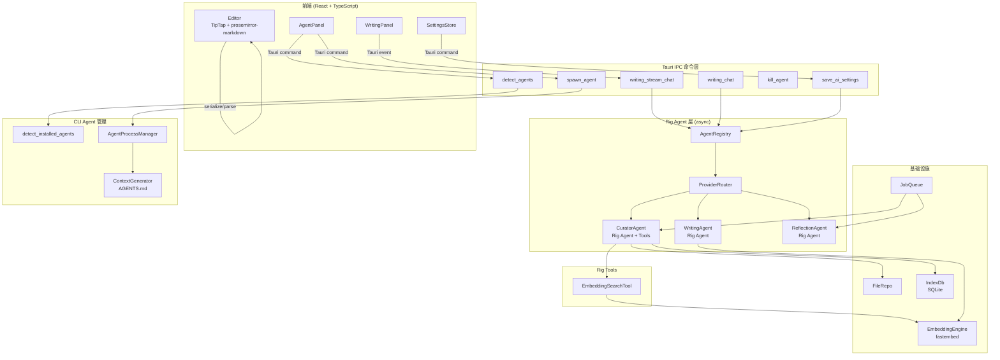
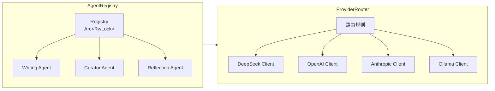

# 技术设计文档 — Cognest Phase 3

## Overview

本设计文档覆盖 Cognest Phase 3 的三大技术模块重构：

1. **Rig Agent 层重构** — 用 Rig 框架替换手写的 `LlmGateway` + `Agent` trait，实现真正的 async-first Agent 调用链，消除 `block_on` 死锁，获得原生 tool calling 能力。
2. **Markdown 编辑器升级** — 集成 `prosemirror-markdown` 实现 ProseMirror ↔ Markdown 双向序列化，统一存储格式为纯 Markdown，支持 WYSIWYG/Source 双模式切换。
3. **CLI Agent 集成** — 通过 `tokio::process::Command` spawn 本地 CLI Agent 子进程，流式转发输出，提供完整的进程生命周期管理。

**设计目标：**
- 前端 WritingPanel 及 Tauri event 格式完全不变（前端无感知）
- 消除所有 `block_on` / 同步阻塞 LLM 调用路径
- Rig 统一管理多 Provider（DeepSeek, OpenAI, Anthropic, Ollama）
- Markdown round-trip 一致性（serialize → parse → serialize 逐字符相同）

## Architecture

### 整体系统架构



### Rig Agent 层架构



### 编辑器数据流

```mermaid
sequenceDiagram
    participant User
    participant Editor as TipTap Editor
    participant Ser as MarkdownSerializer
    participant Par as MarkdownParser
    participant Tauri as Rust Backend
    participant FS as 文件系统

    Note over User,FS: 打开文章
    Tauri->>FS: 读取 .md 文件
    FS-->>Tauri: frontmatter + body
    Tauri-->>Editor: body (Markdown)
    Editor->>Par: parse(md)
    Par-->>Editor: ProseMirror Doc

    Note over User,FS: 编辑保存
    User->>Editor: 编辑内容
    Editor->>Ser: serialize(doc)
    Ser-->>Editor: Markdown string
    Editor-->>Tauri: save_article(md)
    Tauri->>FS: 写入 frontmatter + md
```

## Components and Interfaces

### 1. AgentRegistry（Agent 注册中心）

**职责：** 管理所有 Rig Agent 实例的创建、获取和热重载。

```rust
// src-tauri/src/core/rig_agents/registry.rs

use std::sync::Arc;
use tokio::sync::RwLock;

/// Agent 可用性状态
#[derive(Debug, Clone)]
pub enum AgentStatus {
    Available,
    Unavailable { reason: String },
    Reloading,
}

/// Agent 注册中心 — 无 Mutex 阻塞的 async 访问
pub struct AgentRegistry {
    inner: Arc<RwLock<RegistryInner>>,
}

struct RegistryInner {
    writing_agent: Option<WritingRigAgent>,
    curator_agent: Option<CuratorRigAgent>,
    reflection_agent: Option<ReflectionRigAgent>,
    statuses: HashMap<String, AgentStatus>,
}

impl AgentRegistry {
    /// 根据 Provider 配置初始化所有 Agent
    pub async fn new(settings: &AppSettings, settings_mgr: &SettingsManager) -> Self;

    /// 热重载：配置变更后 2s 内完成
    /// 旧实例继续服务直到新实例就绪
    pub async fn reload(&self, settings: &AppSettings, settings_mgr: &SettingsManager);

    /// 获取 Writing Agent（无阻塞）
    pub async fn writing_agent(&self) -> Result<WritingRigAgent, AgentError>;

    /// 获取 Curator Agent（无阻塞）
    pub async fn curator_agent(&self) -> Result<CuratorRigAgent, AgentError>;

    /// 获取 Reflection Agent（无阻塞）
    pub async fn reflection_agent(&self) -> Result<ReflectionRigAgent, AgentError>;
}
```

### 2. ProviderRouter（Provider 路由器）

**职责：** 根据用户配置的路由规则创建 Rig Client 实例。

```rust
// src-tauri/src/core/rig_agents/router.rs

use rig::providers::{openai, anthropic};

/// 支持的 Provider 类型
#[derive(Debug, Clone)]
pub enum RigProvider {
    DeepSeek(openai::Client),    // DeepSeek API 兼容 OpenAI
    OpenAI(openai::Client),
    Anthropic(anthropic::Client),
    Ollama(openai::Client),      // Ollama 兼容 OpenAI API
}

/// Provider 路由器
pub struct ProviderRouter {
    providers: HashMap<String, RigProvider>,
    routing: AgentRouting,
}

impl ProviderRouter {
    /// 根据 Agent 名称解析对应的 Provider
    pub fn resolve(&self, agent_name: &str) -> Result<&RigProvider, AgentError>;

    /// 从配置构建所有 Provider Client
    pub fn from_config(
        settings: &AppSettings,
        settings_mgr: &SettingsManager,
    ) -> Result<Self, AgentError>;

    /// Provider 回退逻辑：指定 Provider 不可用时回退到 default
    pub fn resolve_with_fallback(&self, agent_name: &str) -> Result<&RigProvider, AgentError>;
}
```

### 3. WritingRigAgent（写作 Agent）

**职责：** 基于 Rig 框架的写作辅助 Agent，支持流式输出。

```rust
// src-tauri/src/core/rig_agents/writing.rs

use rig::agent::Agent;
use rig::streaming::{StreamingPrompt, StreamedAssistantContent};

/// 写作 Agent — 构建 Rig agent 实例
pub struct WritingRigAgent {
    agent: rig::agent::Agent<openai::CompletionModel>,
}

impl WritingRigAgent {
    /// 使用 Rig Client 构建 Agent
    pub fn new(client: &openai::Client, model: &str) -> Self {
        let agent = client
            .agent(model)
            .preamble(WRITING_SYSTEM_PROMPT)
            .build();
        Self { agent }
    }

    /// 流式对话 — 返回 Rig stream，调用方负责转为 Tauri event
    pub async fn stream_chat(
        &self,
        article_context: &str,
        related_fragments: &[String],
        message: &str,
        history: Vec<rig::message::Message>,
    ) -> Result<impl Stream<Item = Result<StreamedAssistantContent, CompletionError>>, AgentError>;

    /// 同步对话（完整响应）
    pub async fn chat(
        &self,
        article_context: &str,
        related_fragments: &[String],
        message: &str,
        history: Vec<rig::message::Message>,
    ) -> Result<String, AgentError>;
}
```

### 4. CuratorRigAgent + EmbeddingSearchTool

**职责：** Curator Agent 使用 Rig tool calling 自主决定何时搜索相似碎片。

```rust
// src-tauri/src/core/rig_agents/curator.rs

use rig::tool::{Tool, ToolDefinition};
use serde::{Deserialize, Serialize};

/// EmbeddingSearch 工具输入
#[derive(Deserialize, Serialize, schemars::JsonSchema)]
pub struct EmbeddingSearchArgs {
    /// 查询文本，不超过 2000 字符
    pub query: String,
}

/// EmbeddingSearch 工具输出
#[derive(Deserialize, Serialize)]
pub struct EmbeddingSearchResult {
    pub matches: Vec<SimilarMatch>,
}

#[derive(Deserialize, Serialize)]
pub struct SimilarMatch {
    pub fragment_id: String,
    pub similarity: f32,
}

/// Rig Tool 实现
pub struct EmbeddingSearchTool {
    embedding: Arc<EmbeddingEngine>,
    index: Arc<RwLock<IndexDb>>,
}

impl Tool for EmbeddingSearchTool {
    const NAME: &'static str = "embedding_search";
    type Error = ToolError;
    type Args = EmbeddingSearchArgs;
    type Output = EmbeddingSearchResult;

    async fn definition(&self, _prompt: String) -> ToolDefinition {
        ToolDefinition {
            name: "embedding_search".to_string(),
            description: "搜索与查询文本最相似的碎片".to_string(),
            parameters: schemars::schema_for!(EmbeddingSearchArgs)
                .pipe(|s| serde_json::to_value(s).unwrap()),
        }
    }

    async fn call(&self, args: Self::Args) -> Result<Self::Output, Self::Error> {
        let query = &args.query[..args.query.len().min(2000)];
        let query_vec = self.embedding.embed_text(query)?;
        let all_ids = self.embedding.cached_fragment_ids();
        let results = self.embedding.find_similar_by_vec(&query_vec, &all_ids, 5)?;
        Ok(EmbeddingSearchResult {
            matches: results.into_iter()
                .map(|(id, sim)| SimilarMatch { fragment_id: id, similarity: sim })
                .collect(),
        })
    }
}

/// Curator Agent — 带 tool calling
pub struct CuratorRigAgent {
    agent: rig::agent::Agent<openai::CompletionModel>,
}

impl CuratorRigAgent {
    pub fn new(
        client: &openai::Client,
        model: &str,
        embedding: Arc<EmbeddingEngine>,
        index: Arc<RwLock<IndexDb>>,
    ) -> Self {
        let tool = EmbeddingSearchTool { embedding, index };
        let agent = client
            .agent(model)
            .preamble(CURATOR_SYSTEM_PROMPT)
            .tool(tool)
            .build();
        Self { agent }
    }

    /// 执行分类任务
    pub async fn classify_fragment(
        &self,
        fragment_content: &str,
    ) -> Result<ClassifyResult, AgentError>;

    /// 生成标签（1-5个，每个≤10字符）
    pub async fn generate_tags(
        &self,
        fragment_content: &str,
    ) -> Result<Vec<String>, AgentError>;
}
```

### 5. StreamChunk 适配层

**职责：** 将 Rig 的 `StreamedAssistantContent` 转换为现有 Tauri event 格式。

```rust
// src-tauri/src/core/rig_agents/stream_adapter.rs

use crate::core::llm::StreamChunk; // 保留旧 StreamChunk 类型定义用于序列化

/// 将 Rig streaming 转换为 Tauri event payload
pub async fn stream_to_tauri_events(
    mut stream: impl Stream<Item = Result<StreamedAssistantContent, CompletionError>> + Unpin,
    app: &tauri::AppHandle,
    cancel_token: CancellationToken,
) -> StreamResult {
    let mut total_content = String::new();

    loop {
        tokio::select! {
            chunk = stream.next() => {
                match chunk {
                    Some(Ok(StreamedAssistantContent::Text(text))) => {
                        total_content.push_str(&text);
                        let payload = StreamChunk::Delta { content: text };
                        let _ = app.emit("writing_chunk", &serde_json::to_string(&payload).unwrap());
                    }
                    Some(Ok(StreamedAssistantContent::FinalUsage(usage))) => {
                        let payload = StreamChunk::Done {
                            usage: TokenUsage {
                                prompt_tokens: usage.prompt_tokens,
                                completion_tokens: usage.completion_tokens,
                                total_tokens: usage.total_tokens,
                            }
                        };
                        let _ = app.emit("writing_chunk", &serde_json::to_string(&payload).unwrap());
                        break;
                    }
                    Some(Err(e)) => {
                        let payload = StreamChunk::Error {
                            error: LlmError::Unknown {
                                provider: "rig".into(),
                                reason: e.to_string(),
                            },
                            partial_tokens: 0,
                        };
                        let _ = app.emit("writing_chunk", &serde_json::to_string(&payload).unwrap());
                        break;
                    }
                    None => {
                        // Stream 正常结束但无 FinalUsage
                        let payload = StreamChunk::Done {
                            usage: TokenUsage { prompt_tokens: 0, completion_tokens: 0, total_tokens: 0 }
                        };
                        let _ = app.emit("writing_chunk", &serde_json::to_string(&payload).unwrap());
                        break;
                    }
                    _ => {} // ToolCallDelta — Writing Agent 不用 tool
                }
            }
            _ = cancel_token.cancelled() => {
                let payload = StreamChunk::Done {
                    usage: TokenUsage { prompt_tokens: 0, completion_tokens: 0, total_tokens: 0 }
                };
                let _ = app.emit("writing_chunk", &serde_json::to_string(&payload).unwrap());
                break;
            }
        }
    }

    StreamResult { content: total_content }
}
```

### 6. MarkdownSerializer / MarkdownParser（前端）

**职责：** 基于 `prosemirror-markdown` 实现 PM Doc ↔ Markdown 双向转换。

```typescript
// src/utils/markdownSerializer.ts

import { MarkdownSerializer, MarkdownSerializerState } from 'prosemirror-markdown';
import { Node as PMNode, Schema } from 'prosemirror-model';

/**
 * 自定义 MarkdownSerializer
 * 支持节点：heading, paragraph, blockquote, code_block, bullet_list,
 *          ordered_list, horizontal_rule, image, referenceChip
 * 支持 marks：bold(**), italic(*), code(`), link([]()), strikethrough(~~)
 */
export function createMarkdownSerializer(schema: Schema): MarkdownSerializer {
    return new MarkdownSerializer(
        {
            // Node serializers
            heading(state, node) { /* ... */ },
            paragraph(state, node) { /* ... */ },
            blockquote(state, node) { /* ... */ },
            code_block(state, node) { /* ... */ },
            bullet_list(state, node) { /* ... */ },
            ordered_list(state, node) { /* ... */ },
            list_item(state, node) { /* ... */ },
            horizontal_rule(state) { /* ... */ },
            image(state, node) { /* ... */ },
            // 自定义节点：ReferenceChip → @[id]
            referenceChip(state, node) {
                state.write(`@[${node.attrs.fragmentId}]`);
            },
            hard_break(state) { state.write('\\\n'); },
        },
        {
            // Mark serializers
            bold: { open: '**', close: '**', mixable: true, expelEnclosingWhitespace: true },
            italic: { open: '*', close: '*', mixable: true, expelEnclosingWhitespace: true },
            code: { open: '`', close: '`', escape: false },
            link: {
                open: (_state, mark) => '[',
                close: (_state, mark) => `](${mark.attrs.href})`,
            },
            strikethrough: { open: '~~', close: '~~', mixable: true },
        },
    );
}
```

```typescript
// src/utils/markdownParser.ts

import { MarkdownParser } from 'prosemirror-markdown';
import markdownit from 'markdown-it';
import { Schema } from 'prosemirror-model';

/**
 * 自定义 MarkdownParser
 * 解析 CommonMark + GFM strikethrough + @[id] 自定义语法
 */
export function createMarkdownParser(schema: Schema): MarkdownParser {
    const md = markdownit('commonmark')
        .enable('strikethrough')
        .use(referenceChipPlugin); // 自定义 inline rule: @[hex8]

    return new MarkdownParser(schema, md, {
        heading: { block: 'heading', getAttrs: (tok) => ({ level: +tok.tag.slice(1) }) },
        paragraph: { block: 'paragraph' },
        blockquote: { block: 'blockquote' },
        code_block: { block: 'code_block', getAttrs: (tok) => ({ language: tok.info || '' }) },
        bullet_list: { block: 'bullet_list' },
        ordered_list: { block: 'ordered_list', getAttrs: (tok) => ({ order: tok.attrGet('start') || 1 }) },
        list_item: { block: 'list_item' },
        horizontal_rule: { node: 'horizontal_rule' },
        image: { node: 'image', getAttrs: (tok) => ({ src: tok.attrGet('src'), alt: tok.children?.[0]?.content || '' }) },
        hardbreak: { node: 'hard_break' },
        // 自定义节点
        reference_chip: { node: 'referenceChip', getAttrs: (tok) => ({ fragmentId: tok.content }) },
        // Marks
        em: { mark: 'italic' },
        strong: { mark: 'bold' },
        code_inline: { mark: 'code' },
        link: { mark: 'link', getAttrs: (tok) => ({ href: tok.attrGet('href') }) },
        s: { mark: 'strikethrough' },
    });
}
```

### 7. AgentProcessManager（CLI Agent 进程管理）

**职责：** 管理 CLI Agent 子进程的 spawn、流式输出和终止。

```rust
// src-tauri/src/core/cli_agents/process_manager.rs

use tokio::process::{Command, Child};
use tokio::io::{AsyncBufReadExt, BufReader};

/// CLI Agent 信息
#[derive(Debug, Clone, Serialize, Deserialize)]
pub struct CliAgentInfo {
    pub name: String,
    pub command: String,
    pub path: String,       // 绝对路径
    pub version: String,    // --version 输出或 "版本未知"
    pub available: bool,
}

/// 进程状态
#[derive(Debug, Clone, Serialize, Deserialize)]
pub enum ProcessState {
    Idle,
    Running { pid: u32, started_at: String },
    Finished { exit_code: i32, duration_secs: u64 },
}

/// Agent 进程管理器（单进程限制）
pub struct AgentProcessManager {
    current: Arc<Mutex<Option<RunningProcess>>>,
}

struct RunningProcess {
    child: Child,
    started_at: Instant,
}

impl AgentProcessManager {
    pub fn new() -> Self;

    /// 检测已安装的 CLI Agent（扫描 PATH，执行 --version）
    pub async fn detect_agents() -> Vec<CliAgentInfo>;

    /// Spawn CLI Agent 子进程
    /// - 生成/更新 AGENTS.md 后再启动
    /// - stdout/stderr 逐行转发为 Tauri event
    pub async fn spawn(
        &self,
        cli_command: &str,
        prompt: &str,
        cwd: &Path,
        context_md: Option<&str>,
        app: &tauri::AppHandle,
    ) -> Result<(), AgentError>;

    /// 终止当前进程（SIGTERM → 5s → SIGKILL）
    pub async fn kill(&self) -> Result<(), AgentError>;

    /// 当前进程状态
    pub async fn status(&self) -> ProcessState;
}
```

### 8. ContextGenerator（AGENTS.md 生成器）

```rust
// src-tauri/src/core/cli_agents/context.rs

/// 生成 AGENTS.md 文件内容
pub fn generate_agents_md(
    vault_path: &Path,
    topics: &[String],
) -> Result<String, std::io::Error> {
    // 包含：
    // - CognestVault 顶层目录结构（depth ≤ 2）
    // - 碎片/文章 frontmatter 字段说明
    // - 当前所有 topics 名称列表
}
```

## Data Models

### 保留的 StreamChunk 格式（不变）

```rust
/// 流式响应 chunk — 保持与旧版完全一致的 serde 格式
#[derive(Debug, Clone, Serialize, Deserialize)]
#[serde(tag = "type", rename_all = "lowercase")]
pub enum StreamChunk {
    Delta { content: String },
    Done { usage: TokenUsage },
    Error { error: LlmError, partial_tokens: u32 },
}

#[derive(Debug, Clone, Serialize, Deserialize)]
pub struct TokenUsage {
    pub prompt_tokens: u32,
    pub completion_tokens: u32,
    pub total_tokens: u32,
}
```

### 新增 AgentError 枚举

```rust
/// Rig Agent 层错误类型
#[derive(Debug, thiserror::Error, Serialize, Deserialize)]
pub enum AgentError {
    #[error("Agent 不可用: {reason}")]
    AgentUnavailable { agent: String, reason: String },

    #[error("无可用 Provider")]
    NoProvider,

    #[error("Provider 回退: {from} → {to}")]
    ProviderFallback { from: String, to: String },

    #[error("LLM 调用失败: {0}")]
    LlmFailure(String),

    #[error("Tool 调用失败: {0}")]
    ToolFailure(String),

    #[error("请求超时")]
    Timeout,

    #[error("流已取消")]
    Cancelled,

    #[error("Embedding 错误: {0}")]
    Embedding(String),

    #[error("进程 spawn 失败: {0}")]
    ProcessSpawn(String),

    #[error("进程已在运行")]
    ProcessAlreadyRunning,
}
```

### CLI Agent Event 格式

```rust
/// CLI Agent 输出事件
#[derive(Debug, Clone, Serialize)]
#[serde(tag = "type")]
pub enum AgentOutputEvent {
    /// stdout/stderr 行输出
    Line { content: String, stream: String }, // stream: "stdout"|"stderr"
    /// 进程退出
    Exit { code: i32, duration_secs: u64 },
    /// 错误（spawn 失败等）
    Error { reason: String },
}
```

### Tauri Command 接口变更

```rust
// 新的 async command — 替代旧的 spawn_blocking 模式

#[tauri::command(async)]
pub async fn writing_stream_chat(
    state: State<'_, RigState>,  // 新的 state 类型
    app: tauri::AppHandle,
    article_id: String,
    message: String,
    history: Vec<ChatMessage>,
) -> Result<(), String>;

#[tauri::command(async)]
pub async fn detect_cli_agents() -> Result<Vec<CliAgentInfo>, String>;

#[tauri::command(async)]
pub async fn spawn_cli_agent(
    state: State<'_, CliAgentState>,
    app: tauri::AppHandle,
    command: String,
    prompt: String,
    article_content: Option<String>,
) -> Result<(), String>;

#[tauri::command(async)]
pub async fn kill_cli_agent(
    state: State<'_, CliAgentState>,
) -> Result<(), String>;
```


## Correctness Properties

*属性（Property）是系统在所有有效执行中都应保持为真的特征或行为——本质上是关于系统应该做什么的形式化陈述。属性作为人类可读规范与机器可验证正确性保证之间的桥梁。*

### Property 1: Agent 不可用返回明确错误

*For any* Agent 名称，如果该 Agent 在 Registry 中被标记为不可用状态（AgentStatus::Unavailable），则请求获取该 Agent 引用 SHALL 返回 `AgentUnavailable` 错误，且错误信息包含不可用原因描述。

**Validates: Requirements 1.6**

### Property 2: Provider 路由正确解析

*For any* Agent 名称和 Provider 配置（含 overrides map 和 defaultProvider），Provider_Router 解析该 Agent 的 Provider 时：
- 若 overrides 中存在该 Agent 的映射，SHALL 返回映射指定的 Provider
- 若 overrides 中不存在该 Agent 的映射，SHALL 返回 defaultProvider

**Validates: Requirements 2.2, 2.3**

### Property 3: Provider 回退逻辑

*For any* Agent 路由请求，如果目标 Provider 标记为不可用（模拟超时或 5xx），Provider_Router SHALL 回退到 defaultProvider 并在返回中标识回退发生。如果所有 Provider 均不可用，SHALL 返回 NoProvider 错误。

**Validates: Requirements 2.4, 2.5**

### Property 4: StreamChunk 格式兼容性

*For any* StreamChunk 枚举值（Delta/Done/Error 三种 variant），其 serde 序列化后的 JSON 字符串 SHALL 满足以下格式：
- Delta: `{"type":"delta","content":"..."}`
- Done: `{"type":"done","usage":{"prompt_tokens":N,"completion_tokens":N,"total_tokens":N}}`
- Error: `{"type":"error","error":{...},"partial_tokens":N}`

即 tag 字段名为 `type`，值为 lowercase variant 名称。

**Validates: Requirements 3.2, 5.5, 5.6**

### Property 5: Markdown Round-Trip 一致性

*For any* ProseMirror Document 仅包含支持的 node 类型（heading, paragraph, blockquote, code_block, bullet_list, ordered_list, horizontal_rule, image）和 mark 类型（bold, italic, code, link, strikethrough），执行 `serialize → parse → serialize` SHALL 产生与第一次 serialize 逐字符相同的 Markdown 字符串。

**Validates: Requirements 6.1, 6.2, 6.3, 7.1, 7.2, 8.1, 8.3**

### Property 6: 不支持节点的文本保留

*For any* ProseMirror Document 包含 Serializer 不支持的 node 或 mark 类型，序列化后的 Markdown SHALL 包含该节点的纯文本内容（不丢弃），且作为 paragraph 输出。

**Validates: Requirements 6.6, 7.4**

### Property 7: 不支持内容的 Round-Trip 稳定性

*For any* ProseMirror Document 包含不支持的 node 类型，经过第一次 round-trip（serialize → parse → serialize）后，再执行第二次 round-trip SHALL 产生与第一次 round-trip 逐字符相同的结果（即不支持内容的纯文本表示保持稳定）。

**Validates: Requirements 8.4**

### Property 8: Frontmatter 分离

*For any* 包含 YAML frontmatter 的 Markdown 字符串（格式为 `---\nyaml_content\n---\nbody_content`），Parser SHALL 仅解析第二个 `---` 之后的 body 部分，frontmatter 不进入 ProseMirror Document。

**Validates: Requirements 8.2**

### Property 9: 写作上下文注入约束

*For any* 文章内容字符串，Writing Agent 构建 prompt 时注入的文章上下文 SHALL 不超过 4000 字符；对于相关碎片列表，SHALL 最多注入 5 条且每条相似度 ≥ 0.5。

**Validates: Requirements 3.4**

### Property 10: EmbeddingSearch Tool 输入输出约束

*For any* 查询文本传入 EmbeddingSearch Tool，工具 SHALL 仅处理前 2000 字符；返回结果 SHALL 最多 5 条，每条 similarity 值在 [0.0, 1.0] 范围内。

**Validates: Requirements 4.3**

### Property 11: Frontmatter 合并无重复

*For any* 碎片的现有 topics 列表和新 topic，合并后 SHALL 不包含重复项；对于生成的 tags 列表，SHALL 包含 1-5 个标签且每个标签不超过 10 个字符。

**Validates: Requirements 4.4**

### Property 12: 单进程约束

*For any* 时刻如果已有一个 Agent_Process 处于运行状态，尝试 spawn 新进程 SHALL 返回 `ProcessAlreadyRunning` 错误而不启动新进程。

**Validates: Requirements 11.6**

### Property 13: 进程输出事件忠实转发

*For any* CLI Agent 子进程的 stdout/stderr 输出序列，每行 SHALL 对应恰好一个 Tauri event（AgentOutputEvent::Line）且内容匹配；当进程退出时 SHALL 发送包含实际退出状态码的 Exit 事件。

**Validates: Requirements 11.3, 11.8**

### Property 14: AGENTS.md 内容完整性

*For any* CognestVault 状态（含目录结构和 topics 列表），生成的 AGENTS.md 文件 SHALL 包含：vault 顶层目录结构（深度不超过 2 层）、碎片和文章的 frontmatter 字段说明、以及当前所有 topics 名称。

**Validates: Requirements 12.4**

### Property 15: Agent Panel 输出缓冲区限制

*For any* 输出行序列超过 5000 行时，Agent_Panel 的输出缓冲区 SHALL 仅保留最近 5000 行，丢弃最旧的行。

**Validates: Requirements 13.3**

## Error Handling

### Agent 层错误策略

| 错误场景 | 处理方式 | 用户可见信息 |
|---------|---------|------------|
| Provider API 密钥无效 | Agent 标记为不可用，记录日志 | "AI 模型未配置，请检查设置" |
| Provider 超时（30s） | 回退到 defaultProvider | 透明回退，前端收到 fallback event |
| 所有 Provider 不可用 | 返回 NoProvider 错误 | "无可用 AI 模型，请在设置中配置" |
| 流式输出中断 | 发送 Error chunk，保留已接收内容 | "网络连接中断" + 已有内容不清除 |
| 用户取消流式输出 | 2s 内发送 Done chunk | 保留已接收的部分内容 |
| Tool calling 失败 | 跳过工具结果，降级为无工具模式 | 静默降级，记录警告日志 |

### 编辑器错误策略

| 错误场景 | 处理方式 | 用户可见信息 |
|---------|---------|------------|
| Markdown 解析失败 | 保持 Source 模式不变 | Toast 提示"Markdown 格式错误" |
| 不支持的节点类型 | 降级为纯文本 paragraph | 无提示（静默降级） |
| 自动保存失败 | 重试 3 次，最后提示用户 | StatusBar 显示保存失败状态 |

### CLI Agent 错误策略

| 错误场景 | 处理方式 | 用户可见信息 |
|---------|---------|------------|
| 命令不存在 / 权限不足 | 发送 Error event | Panel 显示"启动失败：{原因}" |
| 进程运行中启动新进程 | 拒绝，返回错误 | "当前有进程正在运行" |
| AGENTS.md 生成失败 | 记录日志，继续 spawn（降级） | 无提示（静默降级） |
| SIGTERM 后 5s 未退出 | 发送 SIGKILL | Panel 显示"进程已强制终止" |
| 进程异常退出（非零 code） | 发送 Exit event 含 code | 显示退出码和运行时长 |

## Testing Strategy

### 测试方法

本项目采用**双重测试策略**：

1. **属性测试（Property-Based Testing）**：验证跨所有输入的普遍性质
2. **单元测试 / 集成测试**：验证具体场景、边界条件和外部集成

### 属性测试配置

- **框架**：Rust 端使用 `proptest`（已在 dev-dependencies 中），前端使用 `fast-check`
- **迭代次数**：每个属性测试最少 100 次迭代
- **标签格式**：`Feature: cognest-phase3, Property {N}: {property_text}`

### 属性测试覆盖

| Property | 测试位置 | 生成器策略 |
|----------|---------|-----------|
| P1: Agent 不可用错误 | `src-tauri/tests/registry.rs` | 生成随机 agent name + 不可用原因 |
| P2: Provider 路由 | `src-tauri/tests/router.rs` | 生成随机 overrides map + agent names |
| P3: Provider 回退 | `src-tauri/tests/router.rs` | 生成随机可用/不可用 provider 组合 |
| P4: StreamChunk 格式 | `src-tauri/tests/stream_format.rs` | 生成随机 StreamChunk 值 |
| P5: Markdown Round-Trip | `src/__tests__/markdown-roundtrip.test.ts` | 生成随机 PM Document（supported nodes only） |
| P6: 不支持节点文本保留 | `src/__tests__/markdown-fallback.test.ts` | 生成含未知节点的 PM Doc |
| P7: 不支持内容稳定性 | `src/__tests__/markdown-stability.test.ts` | 同 P6，验证二次 round-trip |
| P8: Frontmatter 分离 | `src/__tests__/markdown-frontmatter.test.ts` | 生成随机 YAML + body 组合 |
| P9: 上下文注入约束 | `src-tauri/tests/writing_context.rs` | 生成随机长度文章（0-10000 字符） |
| P10: EmbeddingSearch 约束 | `src-tauri/tests/embedding_tool.rs` | 生成随机查询文本（0-5000 字符） |
| P11: Frontmatter 合并 | `src-tauri/tests/frontmatter_merge.rs` | 生成随机 topics/tags 列表 |
| P12: 单进程约束 | `src-tauri/tests/process_manager.rs` | 模拟并发 spawn 请求 |
| P13: 进程输出转发 | `src-tauri/tests/process_output.rs` | 生成随机 stdout/stderr 行序列 |
| P14: AGENTS.md 完整性 | `src-tauri/tests/context_gen.rs` | 生成随机 vault 目录 + topics |
| P15: 输出缓冲区限制 | `src/__tests__/agent-panel-buffer.test.ts` | 生成随机长度输出序列 |

### 单元测试 / 集成测试覆盖

| 场景 | 测试类型 | 位置 |
|------|---------|------|
| Agent Registry 初始化 | 集成测试 | `src-tauri/tests/` |
| 热重载不中断请求 | 集成测试 | `src-tauri/tests/` |
| Provider 验证（各类型） | 集成测试 | `src-tauri/tests/` |
| 流式取消在 2s 内完成 | 集成测试 | `src-tauri/tests/` |
| Editor 模式切换 | E2E 测试 | `src/__tests__/` |
| CLI Agent 检测 | 单元测试 | `src-tauri/tests/` |
| SIGTERM → SIGKILL 升级 | 集成测试 | `src-tauri/tests/` |
| 空 Markdown 解析 | 边界测试 | `src/__tests__/` |

### 新增依赖

**Rust (Cargo.toml):**
```toml
[dependencies]
rig-core = { version = "0.31", features = ["derive"] }
tokio-util = { version = "0.7", features = ["rt"] }  # CancellationToken

[dev-dependencies]
proptest = "1"          # 已存在
tokio-test = "0.4"
```

**前端 (package.json):**
```json
{
  "dependencies": {
    "prosemirror-markdown": "^1.13",
    "markdown-it": "^14",
    "ansi-to-react": "^6"
  },
  "devDependencies": {
    "fast-check": "^3"
  }
}
```
